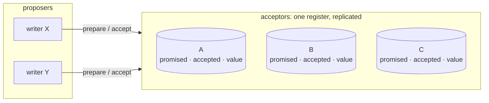
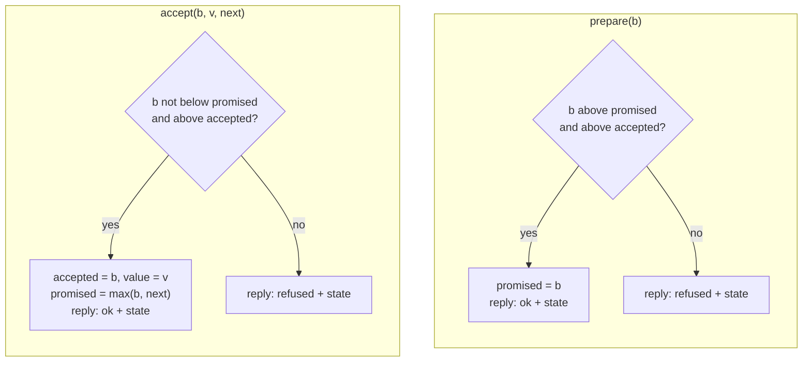
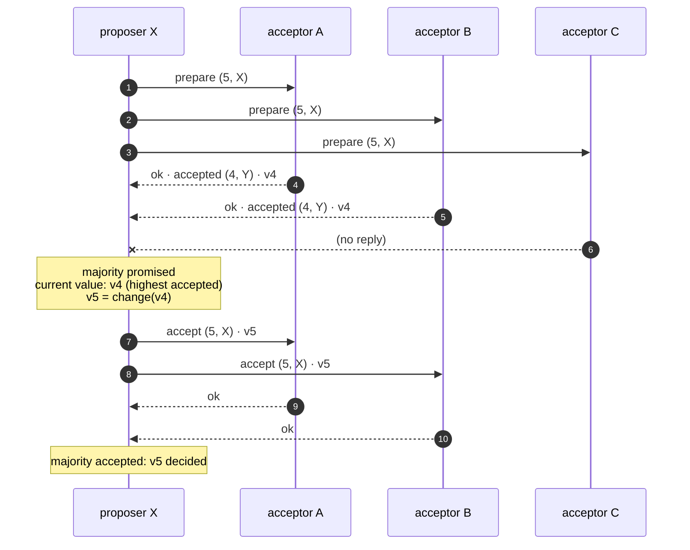
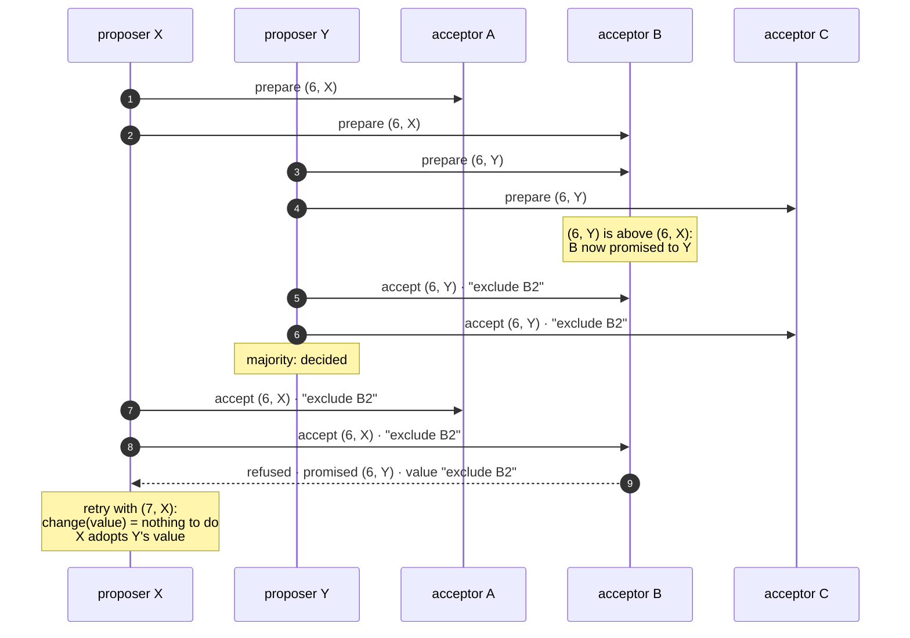
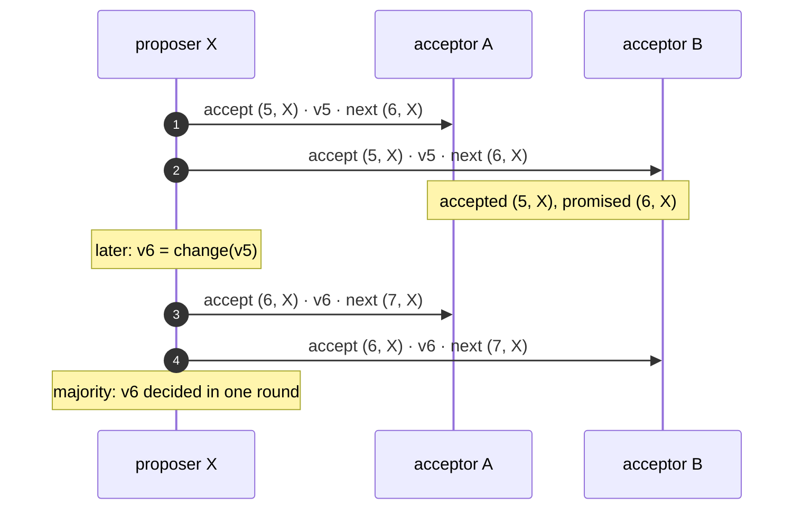

# CASPaxos: a replicated register without a leader

## Status

Legend: ✅ implemented · 🟡 partial · ❌ not implemented yet. *Stage* is
[Multi-attach](multiattach.md)'s numbering, the first user of the register.

| Feature | Stage | Status | Where |
|---|---|---|---|
| `Ballot`, `AcceptorState<V>`, acceptor rules `prepare()` / `accept()` | 1 | ✅ | `librawstd/include/rawstd/caspaxos.hpp`, `librawstd/tests/test_caspaxos.cpp` |
| `accept()` promising the proposer's next ballot (one-round changes) | 1 | ✅ | `rawstd::caspaxos::accept()` |
| The chunk record as an acceptor: `SYNC_PREPARE` / `SYNC_ACCEPT` | 1 | ✅ | `src/blk_backend.cpp`, `ost/src/client.cpp`; [Multi-attach](multiattach.md#the-register-caspaxos) |
| `Proposer<V>`: the two phases as a coroutine over a pluggable transport | 2 | ❌ | — |
| Proposer skipping phase 1 after its own decision | 2 | ❌ | — |

## Overview

CASPaxos (Rystsov, "CASPaxos: Replicated State Machines without logs")
keeps one value replicated over a set of **acceptors** and lets any number
of **proposers** change it, with no leader: a change is a function of the
current value, and it is decided once a majority of acceptors accepted the
result. Two proposers racing each other never decide two different values,
whichever minority each of them reached.

`rawstd::caspaxos` is generic over the value type and over how requests
reach the acceptors. Rawstor uses it for a mirrored chunk's configuration
-- its members are the acceptors, every writer of the chunk a proposer
([Multi-attach](multiattach.md)) -- but nothing in it knows about chunks.



---

## Ballots

A **ballot** is `(counter, proposer id)`, ordered by counter and then by
proposer id, so two proposers never use the same one. The zero ballot is
below every ballot a proposer uses: it is what an acceptor that never saw a
request has promised and accepted.

## The acceptor

Each acceptor stores three things and applies two rules to them. It
persists the result before replying, and **replies with its whole state,
whether the request succeeded or not** -- a proposer always learns the
actual value from the reply itself.

| Stored | Meaning |
|---|---|
| `promised` | The highest ballot this acceptor promised not to go below |
| `accepted` | The ballot the current value was accepted under |
| `value` | The current value |



`next` is optional: on success the acceptor also promises it, which lets
the same proposer make its next change in one round (*One-round changes*).

## A change

A proposer changes the value with a **change function**: given the
current value, it returns the new one, or nothing when the current value
already says what the proposer wanted -- another proposer made the change
first.

1. **Prepare.** The proposer picks a ballot above every ballot it has
   seen and sends `prepare(b)` to every acceptor it reaches. It needs
   promises from a majority.
2. **Choose.** Among the replies it takes the value with the highest
   `accepted` ballot: the current value. It applies the change function to
   it. If the function returns nothing, the proposer is done and adopts
   that value.
3. **Accept.** It sends `accept(b, new value)` to every acceptor it
   reaches. The change is decided once a majority accepted it.



C missed the change. It holds the old value under an older `accepted`
ballot, so any later majority -- which always includes A or B -- shows
the newer value to whoever reads it.

## Conflicts

A refused request carries the acceptor's actual state: the higher
`promised` ballot that beat the proposer, and the value it holds. The
proposer retries from step 1 with a counter above that ballot, and
re-applies its change function to the value it then finds. Often the
change is already there -- the competing proposer wanted the same thing
-- and there is nothing left to do.



## One-round changes

A proposer that has just decided a change usually makes the next one too.
Its accept carries `next`, its own following ballot; each acceptor that
accepts also promises `next`. The proposer's next change then skips the
prepare round and sends `accept(next, ...)` straight away, against the
value it just decided. If another proposer prepared in between, that
accept is refused with the actual state, and the proposer falls back to a
full change from step 1.



---

## API

`librawstd/include/rawstd/caspaxos.hpp`, namespace `rawstd::caspaxos`:

```cpp
struct Ballot { uint64_t counter; uint64_t proposer; };  // ordered

template <typename V>
struct AcceptorState { Ballot promised; Ballot accepted; V value; };

// Each returns whether the request succeeded and updates `state` only
// then; `state` is what the acceptor persists and replies with.
template <typename V>
bool prepare(AcceptorState<V>& state, const Ballot& ballot) noexcept;

template <typename V>
bool accept(AcceptorState<V>& state, const Ballot& ballot, const V& value,
            const Ballot& next = Ballot{});
```

Stage 2 adds the proposer:

- `Proposer<V>` runs a change as a coroutine, over a transport given as
  two calls per acceptor -- `prepare(ballot)` and
  `accept(ballot, value, next)`, each returning the acceptor's actual
  state and whether it succeeded -- and a change function
  `std::optional<V>(const V&)`, `std::nullopt` meaning "already done". It
  returns the decided value.
- It keeps the highest ballot it has seen, uses the one-round path after
  its own decision, and falls back to a full change on any refusal.
- It is driven by unit tests over in-memory acceptors: lost replies,
  competing proposers, minorities, refused one-round accepts.

## Use in rawstor

| Register | Acceptors | Proposers | Value | Document |
|---|---|---|---|---|
| A mirrored chunk's configuration | The chunk's members (its record, next to the data) | Every writer process of the chunk | `epoch`, `sync_id` and its history, member roles, resync owner | [Multi-attach](multiattach.md#the-register-caspaxos) |
