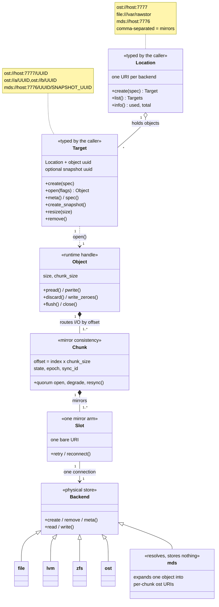
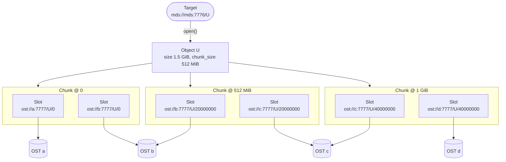

# Concepts

## Status

Legend: ✅ implemented · 🟡 partial · ❌ not implemented yet. Checked against
the `releases/v0.2` code on 2026-10-04. The text below describes the design
as it is on `main`; this table shows what this release actually has.

| Feature | Status | Where |
|---|---|---|
| `ost://`, `file://`, `lvm://`, `zfs://` schemes | ✅ | `src/backend.cpp`, `src/*_backend.cpp` |
| `mds://` scheme | ❌ | no MDS in this release |
| Comma-separated location/target lists, duplicate URIs rejected | ✅ | `src/location.cpp`, `src/target.cpp` |
| `\,` escaping inside a URI | ✅ | `librawstd/src/uri.cpp` |
| Mirroring (`ost://a,ost://b`) | 🟡 | simple fan-out mirror, see [Locations and Targets](locations_and_targets.md) for the limits |
| Data locality (`file://` on the hypervisor + `ost://`) | 🟡 | a mirror with the local copy listed first: reads are always served by the first URI |
| Object / Chunk / Slot runtime model | 🟡 | `src/object.cpp`, `src/chunk.cpp`, `src/slot.cpp`; always one Chunk per Object |
| Internal multi-chunk form, chunk offset path segment | ❌ | — |
| `rawstor_target_chunks()` | ❌ | — |
| Snapshots (snapshot targets, `mds://` and per-slot native CoW) | ❌ | — |

## Overview

Rawstor addresses data through six related concepts, each with its own
URI form: **Location**, **Target**, **Object**, **Chunk**, **Slot**, and
**Snapshot**. A Location names a backend store; a Target names one
specific object within it; Object/Chunk/Slot are the layers a Target
decomposes into once opened; Snapshot is a bound version of any of them.
Only **Location** and **Target** are syntax a caller ever types by hand
(CLI arguments, `rawstor_target_*()`'s own `target` string) — Object,
Chunk and Slot are the client library's internal model of what a Target
opens into, described here so the two visible forms make sense in
context.

### How the pieces fit

A caller types a **Location** or a **Target**; opening a Target gives an
**Object**, which the library splits into **Chunks**, each mirrored over
one or more **Slots**, each talking to one **Backend**:

The same layers on a concrete object: a 1.5 GiB `mds://` object with
512 MiB chunks, two copies each. The caller only ever sees the Target at
the top; everything below it is built by the library from the MDS's chunk
map, and the leaves are plain `ost://` servers:

---

## Location

A **location** specifies the address of a backend data store (or a list
of backends). It is expressed as a comma-separated list of URIs. The URI
format follows the standard scheme `<scheme>://<endpoint>`.

Currently, five URI schemes are supported:

| Scheme | Description |
|--------|-------------|
| `ost`  | Backend server speaking the OST protocol (see [Protocol](protocol.md)) |
| `file` | Local filesystem backend (a folder path) |
| `lvm`  | Local LVM thin pool backend |
| `zfs`  | Local ZFS pool backend |
| `mds`  | Metadata server addressing a whole chunked, possibly multi-copy object rather than a single physical store (see [mds.md](mds.md)) |

### Single backend examples

- `ost://<host>:<port>` – an OST server at the given host and port.
- `file://<path_to_folder>` – a folder on the local filesystem.

### Multiple backends (comma‑separated)

When multiple URIs are listed, the client interprets the list according
to specific policies:

| Example | Behavior |
|---------|----------|
| `ost://host1:port1,ost://host2:port2` | **Mirroring** – both backends contain identical data. |
| `file:///data/folder,ost://host:port` | **Data locality** – the file backend serves as a local cache or fast access path, while the OST backend is the primary remote store. |

Today data locality is plain mirroring (see [Mirroring](mirroring.md)) with
the local copy listed first: reads are served from the first IN-SYNC member
in list order, so they stay on the hypervisor's own disk. The two copies are
still equal mirrors, not a cache in front of a primary store:

- A write is acknowledged only once it has completed on both copies, so
  write latency is the remote OST's.
- The local copy is a full copy of the object, not a cache with eviction.
- With two copies, an open needs both reachable (quorum is > N/2): if
  either the local disk or the OST is down, the object does not open
  automatically.
- After a client crash with both copies DIRTY (case F5 in
  [Mirroring](mirroring.md)), the first copy in the list, the local one,
  wins and the remote copy is resynced from it.

**Syntax rules:**
- Do not add spaces between URIs – use a single comma: `uri1,uri2`
- To include a literal comma within a URI, escape it with a backslash: `\,`
- Each URI must be a valid location (scheme + endpoint).
- All URIs in the list must be unique – duplicates are not allowed.

---

## Target

A **target** identifies a specific object a caller can open, read,
write, create, remove, or snapshot. For a single-URI target, the format
is `<scheme>://<endpoint>/<uuid>`. For multiple URIs (mirroring), the
UUID is appended to each one: `<scheme1>://<endpoint1>/<uuid>,<scheme2>://<endpoint2>/<uuid>,...`

A target that names one snapshot of an object appends the snapshot's UUID: `<scheme>://<endpoint>/<uuid>/<snapshot_uuid>` (on every URI of a multiple target). Such a target can only be opened read-only (`RAWSTOR_READONLY`) or removed.

Where:
- `<scheme>` and `<endpoint>` are the same as for location.
- `<uuid>` is the unique identifier of the object (rawstor uses UUID v7).
- `<snapshot_uuid>` is the identifier of a snapshot of that object (also UUID v7), optional.

### Single backend target examples

- `ost://<host>:<port>/<uuid>` – an object stored on a single OST server.
- `file://<path_to_folder>/<uuid>` – an object stored as a file in a local folder.
- `mds://<host>:<port>/<uuid>` – a whole object addressed through its MDS; always a single URI (no comma list — mirroring/locality here happen per chunk, inside the object, not at this level). See [mds.md](mds.md).

### Multiple backend target (mirroring / locality)

The client uses the same policies as for locations (mirroring, locality, etc.).

Example: `ost://127.0.0.1:9090/019cbfad-a389-7d42-a0f6-c29993ac8c00,file:///var/rawstor/019cbfad-a389-7d42-a0f6-c29993ac8c00`

This target references the same object (UUID `019cbfad-a389-7d42-a0f6-c29993ac8c00`) on two different backends.

**Important:** All URIs in a target list must point to the same UUID. Mixing different UUIDs in one target is not allowed.

### Internal multi-chunk form (not for manual entry)

Opening a target (`rawstor_target_open()`) resolves it into an
**Object** made of one or more **Chunks** (see below). For a plain
target, this is always a single chunk — the target string above, in
full. `mds://` objects need more than one: the client library builds,
internally, a single flat `,`-separated list of every chunk's own URIs,
one after another, with no second separator marking where one chunk's
own group ends and the next begins — `Target`'s own constructor sorts
them back into their chunk groups itself, by each URI's own internal
offset path segment (a chunk's byte offset within the object, `logical_
index * chunk_size` — URIs sharing one offset are mirrors of the same
chunk, distinct chunks always differ). This form only ever exists inside
the library (built by the MDS backend from the object's chunk map) — it
is never part of the target syntax a caller types, appears in the CLI,
or is returned by any `rawstor_target_*()` call. It is documented here
only so the internal model below is unambiguous about where a
multi-chunk Object's own per-chunk URI lists come from.

---

## Object

The **Object** is the client-facing handle a target opens into
([Architecture](architecture.md): "Object = group of chunks") — what
`rawstor_target_open()` returns, and what every `rawstor_object_*()` I/O
call (`pread`/`pwrite`/`discard`/`write_zeroes`/`flush`/`close`) acts on.
It has no URI form of its own: it is *derived* from the target string
that opened it, routing each I/O request to the Chunk that logically
owns the touched byte range. A plain target's Object is always the
degenerate case of exactly one Chunk; an `mds://` target's Object may
route across many.

## Chunk

A **Chunk** is one logical piece of an Object's data — for a plain
target, the whole object; for an `mds://` object, one fixed-size slice of
it (docs/mds.md: with 1 GiB chunks, a 1 TiB object has ≤ 1024 chunks). A
Chunk owns the mirror-consistency protocol (DIRTY/CLEAN/SYNCING,
epoch/sync_id, degrade/resync — docs/mirroring.md) across its own one or
more Slots. Its URI form is exactly a plain target's own: one URI per
mirror, comma-separated, all sharing the same UUID —
`ost://h1:p1/<uuid>,ost://h2:p2/<uuid>`. A single-chunk Object's one
Chunk *is* the target string that opened it; a multi-chunk `mds://`
object's chunks are each one same-offset group of the internal form
above.

## Slot

A **Slot** is one physical mirror arm of a Chunk: a single URI, backed by
one connection pool against one backend, responsible for retrying and
reconnecting on that one arm independently of its siblings. Its URI form
is a single, bare URI: `ost://h1:p1/<uuid>`. A Chunk with N mirrors has N
Slots; a plain, unmirrored target's Chunk has exactly one.

## Snapshot

A **snapshot** is a bound, read-only version of a target/chunk/slot,
identified by a version id (`snapshot_id`, a UUID -- never nil, nil always
means "live"). Like every other id in this design, `snapshot_id` is
client-generated -- the caller picks it (or generates a fresh one, the
same single point of generation a fresh object id comes from) and passes
it to `rawstor_target_create_snapshot()`, either as its `snapshot_id`
argument or already embedded in the target string (with `snapshot_id`
NULL); with neither, a fresh id is generated. `rawstor_target_create()`
never takes a snapshot -- it rejects a target that carries one with
`-EINVAL`. There is no separate "assign" mode, mds:// included: two
independent mechanisms use the same id, at different layers:

- **mds:// object-level**: CoW-every-chunk/`OBJ_COMMIT_SNAPSHOT`
  (docs/mds.md, "Snapshots (stage 2)") registers the caller's id against
  the whole object, driven by `mds::Backend::create_snapshot()`.
- **Per-slot native CoW**: a single backend's own thin-clone/snapshot
  primitive (zfs::Backend today), addressed directly by target/chunk-
  slot URI with the version appended as a trailing path segment, in
  either of two equivalent shapes:
  - **Logical** — no offset segment, for a plain target (there is no
    chunk-offset concept to name at that level):
    `ost://host:port/<uuid>/018f4e2a-3000-7000-8000-000000000001`, or on
    an `mds://` target,
    `mds://host:port/<id>/018f4e2a-3000-7000-8000-000000000001`.
  - **Physical** — an *explicit* offset segment right before the
    version (never omitted, even "0" — see "Chunk offset" below for
    why), the shape every chunk-of-a-larger-object address always uses:
    `ost://host:port/<uuid>/0/018f4e2a-3000-7000-8000-000000000001`.

  Either way this segment is never part of a location and never carries
  a comma-separated list of its own — it binds whichever single URI it's
  attached to.

## Chunk offset (not for manual entry)

A chunk's own byte offset within its parent `mds://` object
(`logical_index * chunk_size`) rides the same URI, as a path segment
right after the UUID: `ost://host:port/<uuid>/100000` (hexadecimal --
`0x100000`, 1MiB; optionally followed by a snapshot segment, e.g.
`ost://host:port/<uuid>/100000/018f4e2a-3000-7000-8000-000000000001`).
Offset and snapshot are told apart from an arbitrary preceding location
path by shape alone (a UUID-shaped segment vs. a hexadecimal one):
`parse_target_path()` (src/target.hpp) reads the identity off the
*end* of the path. A target binds at most one snapshot, so the trailing
run of UUID-shaped segments is at most two long (longer is rejected). A
single trailing UUID preceded by a valid hexadecimal offset (and another
UUID, the id) is the snapshot — the *physical, with a bound snapshot*
shape above; otherwise the run's first segment is the id and its second
(if any) the snapshot — the *logical* shape, offset implied 0. A
location path that itself ends in a UUID-shaped directory is therefore
ambiguous and not supported. If the last segment isn't UUID-shaped at
all (no snapshot to find), it must instead be the hexadecimal
offset itself, with the id right before it — `ost://host:port/<uuid>/
100000` above, the *physical, live* shape: an explicit offset with no
snapshot anywhere in the path. A chunk's own offset is always spelled
out explicitly (one of the two physical shapes) since it's never
0-and-absent-by-convention the way a plain target's own implied offset
is. Like the internal multi-chunk form above, this is built only by
`mds::Backend` from its own chunk map and never something a caller
types — `Target`'s own constructor reads it back out to reconstruct
chunk grouping, and it's also readable through `rawstor_target_chunks()`
directly (a single entry, 0, for a plain, non-`mds://` target).

---

## Summary table

| Concept | Format | Purpose | Example |
|---------|--------|---------|---------|
| **Location** | `<scheme>://<endpoint>` or `uri1,uri2,...` | Address of a backend data store (or a set of stores) | `ost://127.0.0.1:9090` `file:///var/rawstor` |
| **Target** | `<scheme>://<endpoint>/<uuid>` or `uri1,uri2,...` | Address of a specific object a caller opens/creates/removes | `ost://127.0.0.1:9090/019cbfad-a389-7d42-a0f6-c29993ac8c00` `ost://127.0.0.1:9090/019cbfad-a389-7d42-a0f6-c29993ac8c00,file:///var/rawstor/019cbfad-a389-7d42-a0f6-c29993ac8c00` |
| **Object** | (none — derived from the target string that opened it) | The open handle `rawstor_object_*()` I/O acts on; routes to the owning Chunk | — |
| **Chunk** | Same as Target: `uri1,uri2,...` (one UUID per group) | One logical slice of an Object's data; owns mirror consistency | `ost://h1:p1/<uuid>,ost://h2:p2/<uuid>` |
| **Slot** | A single URI | One physical mirror arm of a Chunk; owns retries/reconnects | `ost://h1:p1/<uuid>` |
| **Snapshot** | Trailing path segment on a target/chunk-slot URI (logical: right after the id; physical: after an explicit offset), `snapshot_id` a client-generated UUID | A bound, read-only version | `ost://host:port/<uuid>/018f4e2a-3000-7000-8000-000000000001` |

---

## Notes

- When using the `file://` scheme, the path must be absolute. Relative paths are not allowed.
- The wire protocol (commands, frame layouts, error reporting) is described in the [protocol specification](protocol.md).
- **On naming**: this document's "Location"/"Target" pair, and the
  Object/Chunk/Slot model above, could arguably be called a "topology" —
  but that word is already taken: [mds.md](mds.md) uses "topology" for a
  different, unrelated concept (the MDS's own static list of known OSTs,
  `TOPOLOGY_PATH`/`topology.conf`, scanned by `rawstor-mds --reconstruct`).
  Reusing it here for this document would make the two docs' shared
  vocabulary actively misleading, so this file keeps its current name.
