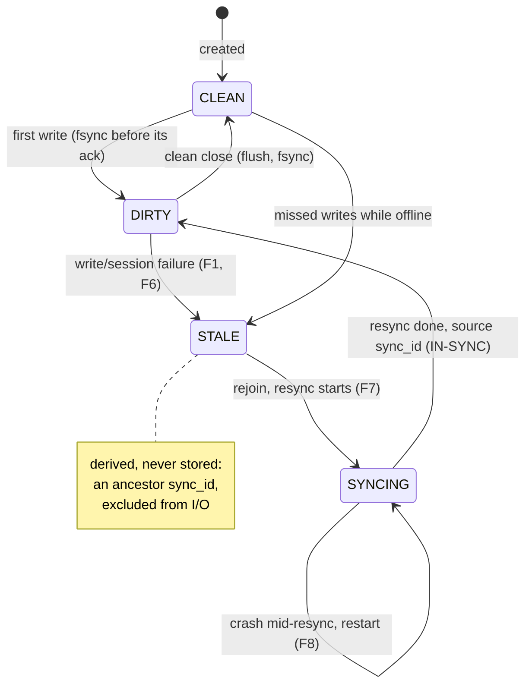
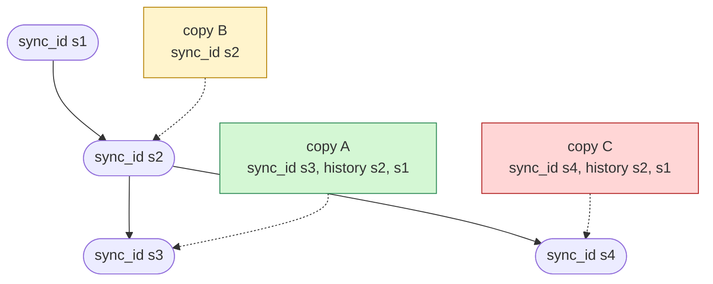
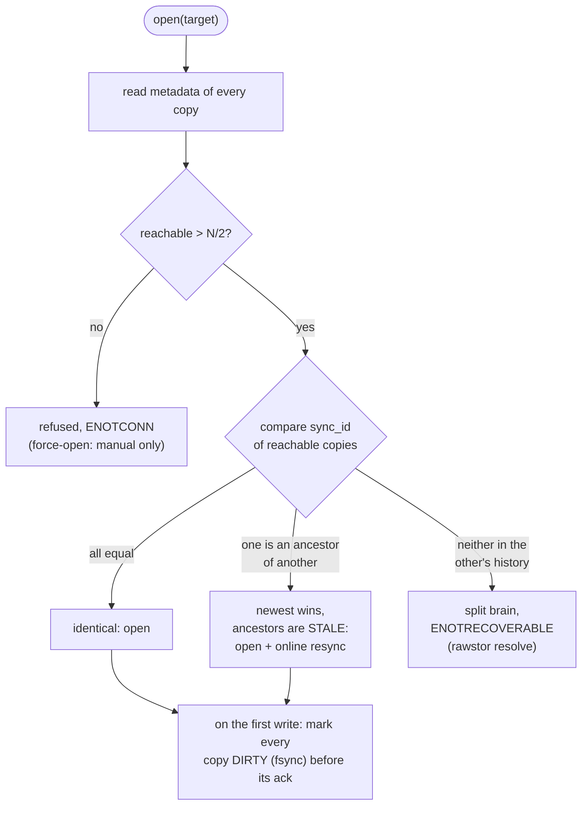
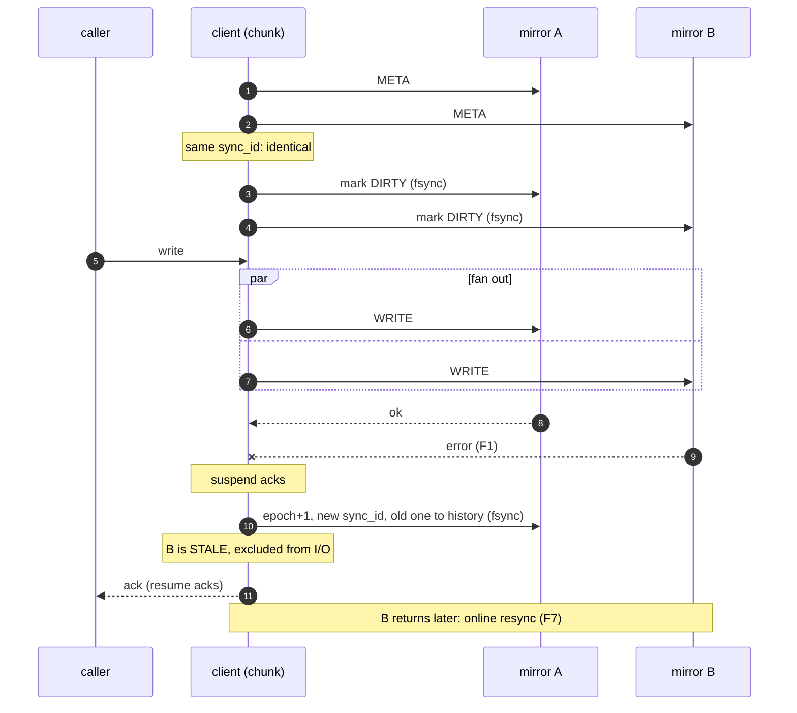
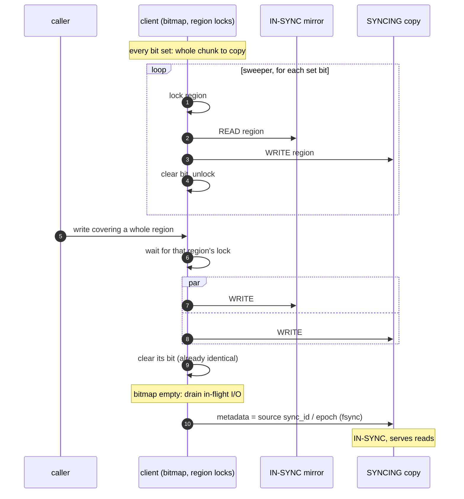

# Mirroring: Failure Model and Recovery

## Status

Legend: ✅ implemented · 🟡 partial · ❌ not implemented yet.
*Stage* is this document's own numbering (see
*Implementation stages*); [MDS design](mds.md) numbers its stages separately.

| Feature | Stage | Status | Where |
|---|---|---|---|
| Per-copy metadata (`state`, `epoch`, `sync_id`, history) on `file://` | 1 | ✅ | `src/file_backend.cpp` |
| Per-copy metadata on `lvm://` / `zfs://` (LVM tags, ZFS user properties) | 1 | ✅ | `src/lvm_backend.cpp`, `src/zfs_backend.cpp` |
| `META`, `SET_SYNC_STATE`, `FLUSH` opcodes | 1 | ✅ | `include/rawstor/protocol.h`, `ost/src/client.cpp` |
| Metadata transitions fsynced before the ack | 1 | ✅ | `src/chunk.cpp` |
| `rawstor_target_meta()` / `rawstor_target_set_member_sync_state()` | 1 | ✅ | `include/rawstor/target.h` |
| Quorum at open (> N/2), split-brain detection | 2 | ✅ | `src/chunk.cpp` |
| Degraded open, F10 recreate of a missing copy | 2 | ✅ | `src/chunk.cpp` |
| Degrade & continue (F1), write freeze below quorum for N ≥ 3 | 2 | ✅ | `src/chunk.cpp` |
| Read failover and read-repair (F2) | 2 | ✅ | `src/chunk.cpp` |
| Clean close (all copies `CLEAN`) | 2 | ✅ | `src/chunk.cpp` |
| Online resync with in-memory bitmap, region locks, zero-region `write_zeroes` | 3 | ✅ | `src/chunk.cpp` (`RESYNC_CHUNK`) |
| Reconnect probe and automatic rejoin of STALE mirrors | 3 | ✅ | `src/chunk.cpp` (`_probe_watch()`) |
| `rawstor show -v` per-chunk / per-mirror state | — | ✅ | `cli/show.c` |
| `rawstor resolve TARGET --winner=N [--offset]` | — | ✅ | `cli/resolve.c` |
| Force-open below quorum (CLI / opts) | — | ❌ | — |
| Persistent write-intent bitmap (resumable resync, cheaper F5) | 4 | ❌ | — |
| MDS witness in quorum | 4 | ❌ | designed in [MDS design](mds.md#witness-stage-3) |
| Stored checksums / scrub | 4 | ❌ | — |
| Fastest-mirror read selection | 4 | ❌ | — |

## Overview

A comma-separated target list (see [Concepts](concepts.md)) makes the client keep N identical copies of a chunk on different backends -- each copy is a **slot**, addressed by one URI in the list. A plain (non-`mds://`) target is the degenerate single-chunk case: the whole object it addresses **is** that one chunk, so everything below applies to it directly; an `mds://` object's own chunks (`docs/mds.md`) each get this same treatment independently, possibly with different widths. This document defines the failure model for N-way mirroring: what can fail, how the client reacts, and how byte-for-byte identity of the copies is restored afterwards. Erasure coding is out of scope.

Status: stages 1-3 are implemented (per-copy metadata, quorum open, degrade & continue, read failover/repair, clean close, online resync with automatic rejoin through a periodic reconnect probe) for all backends, including `lvm://`/`zfs://` (native ZFS user properties / LVM tags — see below). Not yet implemented: a persistent write-intent bitmap (a crashed resync restarts from scratch and an unclean shutdown costs a full resync), stored checksums/scrub, the MDS witness.

Error codes: open without quorum (including the case where every mirror is unreachable, F3) fails with `-ENOTCONN`; split brain (or no trusted member) fails with `-ENOTRECOVERABLE`; a write that loses its write quorum, or every member, on an already-open chunk fails with `-EIO`.

---

## Model and assumptions

- **Single writer per object.** An object is a virtual disk used by one client at a time (e.g. one VM via `rawstor-vhost` or the QEMU driver). Enforcing exclusivity (leases / exclusive open) is out of scope and is assumed.
- **Client-side replication.** The client fans out writes to all mirrors; OSTs do not know about each other and never talk to each other.
- **Identity** means: after recovery completes, all IN-SYNC copies are byte-for-byte equal. Writes that were never acknowledged to the caller may land on any subset of copies or none (RAID1 write-hole semantics — the application must not rely on them).
- **Write acknowledgement** to the caller requires completion on **all IN-SYNC mirrors** (latency = slowest mirror).

---

## Per-copy metadata

Each backend stores, next to the chunk's data, a metadata record (an extension of the current `.spec`, which today holds only `size`). The on-disk format is versioned.

| Field | Type | Meaning |
|-------|------|---------|
| `size` | uint64 | Logical chunk size (as today) |
| `state` | enum | `CLEAN` \| `DIRTY` \| `SYNCING` |
| `epoch` | uint64 | Monotonic counter; bumped on every change of mirror-set health/membership |
| `sync_id` | uint64 | Random id of the current sync set; regenerated only when the set's membership shrinks (see *When `sync_id` changes*) |
| `sync_id_history[4]` | uint64[] | Previous `sync_id`s (ancestry), DRBD-generation-UUID style |

`STALE` is not stored — it is derived by comparing copies.

A copy's life cycle (`STALE` included for clarity, though it is only ever
derived):

At the API level (`include/rawstor/target.h`) this record is split by cost and mutability: `RawstorObjectSpec` (`size`, `width`) is the cheap, always-fail-over-safe half read by `rawstor_target_spec()`; `RawstorObjectSyncState` (`state`/`epoch`/`sync_id`/`sync_id_history`) is the mirror consistency half, read via `rawstor_target_meta()` (which returns both, composed as `RawstorObjectMeta{spec, sync_state}`, one entry per URI of the one chunk named by its own explicit `offset` parameter — unlike `spec()`'s single-answer fail-over, so a caller can see every copy of that chunk's own state; a URI that doesn't answer gets a zero-filled entry, see its own doc comment). The writer, `rawstor_target_set_member_sync_state()`, addresses one real member of one chunk at a time (its own `offset` and `member_index` parameters, the same order `meta()` reports that chunk's own members in), and is part of the public API too, but is a sharp tool: it exists for `rawstor-ost` (to relay an incoming `SET_SYNC_STATE` wire command to its own locally configured locations, one call per member), this project's own tests, and future tooling that already understands this model (e.g. `rawstor resolve`'s own split-brain recovery flow) — setting mirror consistency state by hand can desynchronize a target's copies in ways the library's own quorum/reconciliation logic isn't designed to recover from automatically, so it isn't meant for routine application use. On an `mds://` object target (docs/mds.md) — which has many chunks, each with its own slots, not addressable through any flat per-URI `_uris` list at all — both calls resolve `offset` to that object's own real chunk via a live MDS round trip first (`-ENOENT` if the object has no chunk there), then operate on that chunk's own real members exactly as for a plain target: the real per-chunk DIRTY/CLEAN state lives one level down, but is fully reachable through the object-level target, not synthesized.

### Comparison rules (at open)

| Observation | Verdict |
|-------------|---------|
| Same `sync_id`, all `CLEAN` | Copies are identical |
| `sync_id` of copy A appears in history of copy B | A is an ancestor → A is stale, resync A ← B |
| Different `sync_id`s, neither is an ancestor of the other | **Split brain** — automatic resync forbidden. Unreachable through automatic paths thanks to quorum rules (below); kept as defense in depth |
| `state == SYNCING` | Copy is untrusted (interrupted resync) — always stale |

How the lineage decides it: copy B's `sync_id` is in copy A's history, so
B is an ancestor (stale, resynced from A); copies A and C forked after
`s2`, so neither is an ancestor of the other — split brain.

### STALE copies

A copy is **STALE** when it lacks acknowledged writes the rest of the sync
set has: its content can't be trusted for reads and must be resynced
before it counts as a full copy again. Nothing on the copy says so — its
own record may well read `CLEAN` (a copy can't know locally what it missed
while offline) — so staleness is always a verdict about a copy relative
to the others, reached one of two ways:

- **At open**, by the comparison rules above: an ancestor `sync_id`, a
  `SYNCING` state, or a blank `sync_id` 0 next to an established sync set.
- **At runtime**, when a write or the session to a member fails (F1, F6):
  the survivors move to a new `sync_id` behind a barrier, and the failed
  member — still on the old one — is marked STALE in memory.

A STALE copy is excluded from reads and writes. Once it is reachable again
(the reconnect probe, or the next open), an online resync copies the
authoritative data onto it (`SYNCING`), and on completion it joins the
current sync set as IN-SYNC.

### When `sync_id` changes

A `sync_id` names a membership: the set of copies holding every
acknowledged write. It is regenerated (with `epoch`+1, the old one pushed
to history) only when that membership shrinks, i.e. a copy that could
still read as part of the current set is excluded from it:

- **at runtime**, a member degraded by a write/session/read-repair
  failure (F1, F2, F6) — behind the degrade barrier if the chunk is
  `DIRTY`, otherwise by the dirty gate before the first write;
- **at open**, a copy left out without its own record proving it stale:
  an unreachable one (F4 — its record may well carry the current
  `sync_id`, nothing tells otherwise) or one excluded by size alone with
  the current `sync_id` (F11). The new `sync_id` is recorded by the
  dirty gate, before the first write is acknowledged.

Everything else keeps the identity:

- **Reopening with the same membership**, stale copies included: a copy
  on an ancestor `sync_id`, a blank one (`sync_id` 0), or one marked
  `SYNCING` is already excluded by its own record, so a session that
  starts and ends without it — e.g. it stays unreachable to the probe, or
  its resync is interrupted again — writes the same `sync_id`/`epoch`.
- **Rejoin** (F7): a resynced copy adopts the current `sync_id`/`epoch`;
  the set grows, but no copy needs to be told it fell behind.
- **Mark `DIRTY`, clean close**: only `state` changes.

Two exceptions write a new `sync_id` without a membership change: a legacy
set (every copy on `sync_id` 0) gets its first one at the first write, and
`rawstor resolve` (F9) gives its winners a new dominant one.

The open path cannot tell an unreachable copy excluded in an earlier
session from one that just went down, so every session that starts with a
copy unreachable moves to a new `sync_id` once it writes. This is
conservative: the identity only churns while the copy stays down.

### Durability rule

Metadata transitions (marking `DIRTY`, epoch/`sync_id` bump, resync completion) are performed on the backend **with fsync**, and **before** any dependent operation is acknowledged to the caller. These transitions are rare, so this is cheap. Data writes are *not* fsynced per-request; the resulting exposure is covered by rule F6 below.

---

## Quorum: excluding split brain by construction

Key invariant: **every acknowledged write exists on a set of copies that intersects any future auto-start set.** Therefore the newest `sync_id` is always visible at auto-start, and two disjoint write histories cannot be created through automatic paths.

- **Auto-start (open) requires strictly more than N/2 reachable mirrors** (N=2 → both). Within the reachable majority, the copy with the newest `sync_id` is authoritative (majority intersection guarantees it is present); stale copies get an online resync.
- **Below quorum: manual approval only** (force-open via CLI/opts — not yet implemented). There is deliberately no "clean exception": `CLEAN` only means "I was closed correctly" — a copy cannot know locally that it did not miss anything while offline. Alternating offline periods of `CLEAN` copies would produce split brain.
- **Runtime (chunk already open):**
  - N ≥ 3: degrade & continue while more than N/2 mirrors survive; at ≤ N/2 survivors **writes freeze** (policy: error to the caller or block until quorum returns). Otherwise "wrote on minority {A}, later auto-started on majority {B,C}" would orphan acknowledged data.
  - N = 2: **continuing on a single survivor is allowed.** This is safe against split brain because auto-start requires both mirrors, and the abandoned peer remains `DIRTY`/ancestor and can never auto-start alone. It is not free of risk, though: while degraded, every acknowledged write lives on that one survivor only — see *Known limitation: two mirrors, one survivor*.
- **What counts toward a quorum.** The open quorum counts every
  reachable real copy, STALE ones included: the last acknowledged write
  set was itself a majority (or, for N = 2, is guaranteed to be among the
  reachable copies), so any reachable majority contains its newest
  `sync_id`, and the comparison rules pick it out. An unreachable copy
  doesn't count, and neither does a blank copy recreated at this very open
  (F10): it holds none of the acknowledged writes, so letting it make up
  the majority would break the intersection — a survivor that fell behind
  could then be opened as authoritative. The runtime write quorum
  (N ≥ 3) counts only IN-SYNC copies: a STALE or resyncing copy doesn't
  hold the writes it would be vouching for.
- **`sync_id_history` stays as defense in depth**: it catches consequences of a wrong manual force-open, an OST restored from backup, or bugs.
- **Roadmap — MDS as witness.** A future MDS participates in quorum as a metadata-only member (stores `sync_id`/`epoch`, no data). This restores auto-start for 2 data mirrors with one OST down (2 of 3 votes). Not part of v1, but quorum rules and the metadata format are designed so a witness member fits without schema changes (quorum counts all members, including metadata-only ones).

The open decision, put together:

---

## Write lifecycle (all mirrors healthy)

1. **Open:** read metadata of all copies, verify identity. The copies stay as they are (`CLEAN` after a clean close) -- opening alone, or a read-only session, never marks them.
2. **First write** (or read-repair): mark all IN-SYNC copies `DIRTY` (fsync) before it is acknowledged; a membership change not yet recorded (a copy unreachable at open, or degraded while still `CLEAN`) also gets a new `sync_id` here — stale copies already on an ancestor `sync_id` don't (*When `sync_id` changes*). Later writes skip this step.
3. **Write:** fan out to all IN-SYNC mirrors, acknowledge when all complete.
4. **Clean close:** flush data, set all copies `CLEAN` with the same `epoch`/`sync_id` (fsync).

The same with a mirror failing mid-write (F1, N = 2):

---

## Failure cases

| # | Case | Detection | Reaction | Identity recovery |
|---|------|-----------|----------|-------------------|
| F1 | Write failure on one mirror M (network / EIO / timeout, per-connection retries exhausted) | error from the connection layer | If survivors > N/2 (or N=2 with 1 survivor): **suspend acks** → on survivors: `epoch`+1, new `sync_id`, old one pushed to history, fsync → mark M STALE in memory, exclude from I/O → resume acks. If survivors ≤ N/2 with N ≥ 3 — **freeze writes** (see quorum). Log + degradation event | Online resync when M returns (F7) |
| F2 | Read failure / transport hash mismatch on a mirror | error / EPROTO in the read path | Retry the read from another IN-SYNC mirror, return the data. **Read-repair**: rewrite the region on the failing mirror; if the repair write fails → degrade as in F1 | Pointwise via read-repair; on degradation — F7 |
| F3 | All mirrors failed | all connections dead | At open: refused with `ENOTCONN` (degenerate case of F4's below-quorum refusal). On an already-open chunk: `EIO` to the caller on the next write, chunk unavailable. Periodic reconnect attempts | — (no copy available) |
| F4 | OST unreachable at open | connect failure | Reachable > N/2 → degraded open on the majority (it is guaranteed to contain the newest `sync_id`); on survivors `epoch`+1 / new `sync_id` **before the first write ack**. Reachable ≤ N/2 (N=2 with one down falls here) → **auto-start refused**, manual force-open only (not yet implemented) | F7 when it returns |
| F5 | Client crash with writes in flight | at next open: all copies `DIRTY` with the same `sync_id` | All copies are "valid" (they diverge only in unacknowledged regions). Deterministic winner: the first copy in the target list | v1: full online resync of the losers from the winner (expensive — the main argument for a persistent bitmap in v2). I/O is served from the winner immediately |
| F6 | OST crash/restart → acknowledged writes lost from page cache (data is not fsynced) | **not detectable from metadata** (the copy looks up to date) | **Conservative rule: any session loss to a mirror while the chunk is open `DIRTY` ⇒ that mirror is STALE (run the F1 procedure), even if it reconnects immediately.** We cannot know what it lost, so we do not trust it | Full resync (F7) overwrites whatever was lost |
| F7 | A stale mirror returns (rejoin) | reconnect probe + `sync_id`/`epoch` comparison: ancestor → stale | Mark the copy `SYNCING` (fsync), start an **online resync** (algorithm below) without stopping client I/O | On completion: copy metadata = source's `sync_id`/`epoch`, state `DIRTY` (chunk still open), fsync → mirror is IN-SYNC, reads allowed |
| F8 | Client/OST crash during resync | the copy is left `SYNCING` / with an old `sync_id` | Copy is untrusted | Resync from scratch (v1; resumable with the persistent bitmap in v2) |
| F9 | Split brain (disjoint write histories) | different `sync_id`s, neither in the other's history | **Excluded in automatic paths by the quorum rules.** Can only arise from a wrong manual force-open, an OST restored from backup, or a bug → then: open refused with a clear error, no automatic winner | Operator: `rawstor resolve TARGET --winner=N` (`rawstor show -v`'s own `slot[N]` index) → winner gets a new `sync_id`, the loser gets a full resync |
| F10 | Chunk copy missing on one OST (disk lost, OST reprovisioned) | ENOENT when opening the copy (a `file://` location whose directory is gone altogether is unreachable instead, ENOTCONN -- e.g. an unmounted disk) | At open, recreate that copy blank (ALLOCATE, sized off a surviving copy's own META) and treat it as stale. Only when the surviving copies alone are a majority (> N/2): a blank copy never counts toward the quorum, or a survivor that fell behind could be opened as authoritative. So N=2 with one copy missing is not healed automatically: the open fails the quorum check, and the copy is recreated by hand (`rawstor create` on its location) once the survivor is known to be current. Every copy missing is never recreated (nothing vouches the chunk held no data) and the open fails ENOENT. Not on a read-only open or a version | Full online resync (F7) |
| F11 | Copy size mismatch (mixed file/blkdev backends round up to extent/volblocksize — see `src/blk_backend.hpp`) | spec comparison at open | The logical chunk size lives in metadata and is the same everywhere; physical ≥ logical is fine. Physical < logical → the copy is invalid (treat as F10) | — |
| F12 | Silent on-disk corruption (bit rot) | the transport hash does **not** catch it (the server hashes already-rotten data). `zfs://` catches it by itself; `file://` has nothing | v1: documented limitation; a scrub tool (chunk-wise comparison of copies) detects divergence under `CLEAN` metadata but cannot tell which copy is right | v1: operator decision. Long term (v3): stored per-chunk checksums |

---

## Online resync algorithm (client-driven, in-memory bitmap)

Requirements: no downtime, and regions already rewritten by the client onto all mirrors must not be copied again.

1. A bitmap lives in client memory; resync granularity ~1 MiB (a 1 TiB chunk → 128 KiB of bitmap) -- an unrelated, smaller-grained meaning of "chunk" than the mirrored entity this whole document is about (`RESYNC_CHUNK` in code). Initially all bits are set = "needs copy" (v1 is always a full resync).
2. Client I/O continues throughout: reads are served **only from IN-SYNC mirrors**; **writes go both to IN-SYNC mirrors and to the SYNCING copy**. A write that fully covers a chunk clears its bit (that region is already identical). A partially covered chunk keeps its bit.
3. A sweeper walks the bitmap: for each set bit it reads the chunk from a source mirror, writes it to the SYNCING copy, clears the bit. A chunk that reads back all zeros (typically never written) goes out as `write_zeroes` with unmap instead -- no payload on the wire, and the SYNCING copy stays sparse. Rate limiting (option) protects foreground I/O.
4. **Ordering hazard, sweeper × client write to the same chunk:** a per-chunk lock in client memory (single writer, cheap) — a client write to a chunk currently being copied waits for the chunk copy to finish (or vice versa). Otherwise the sweeper could overwrite a fresh client write with stale source data.
5. Bitmap empty → drain in-flight I/O → the SYNCING copy's metadata is set to the source's `sync_id`/`epoch` (fsync) → the mirror is IN-SYNC.

If the client or the target OST crashes mid-resync, the copy remains `SYNCING` and the resync restarts from scratch (F8). A persistent write-intent bitmap (v2) makes it resumable and shrinks the F5 full resync to recently-touched regions.

### Known limitation: the degrade-barrier window

Without per-write fsync there is an irreducible window between an
acknowledged write and the durable exclusion of a failed member (one metadata
round trip): if an OST crash (losing acknowledged writes from page cache)
is followed by a client crash *before* the F1/F6 barrier lands, the next
open sees all copies `DIRTY` in the same sync set (F5) and the
deterministic winner may be the member that lost data. Closing this window
requires synchronous writes or a witness; it is accepted for now and
bounded by the barrier latency.

### Known limitation: two mirrors, one survivor

A 2-way mirror keeps accepting writes on a single survivor when the other
copy fails mid-session (F1), favoring availability: a single OST outage
doesn't stall the guest. The price is that, until the failed copy is back
and resynced, acknowledged writes have no redundancy. If the survivor is
then lost as well — its disk replaced or pool recreated before the
resync — those writes are gone:

1. Copies A and B are in sync; B fails mid-session. A moves to a new
   `sync_id` and keeps acknowledging writes; B stays `DIRTY` on the old
   one.
2. A's copy is lost (ENOENT) before B is resynced.
3. B comes back, but it only holds the data from before step 1.

Nothing can recover those writes, but the loss is never silent: B alone is
not a majority, and a copy recreated in A's place never counts toward the
quorum (F10), so the open is refused rather than served off B as if it were
current. An operator who accepts B's content recreates A's copy by hand,
and the next open resyncs it from B.

Avoiding the window takes a third vote: three data copies (N = 3 freezes
writes below a majority instead of continuing on one copy) or, for two data
copies, a witness (*Roadmap — MDS as witness* above).

---

## Protocol and code changes

- **`include/rawstor/protocol.h`** — new opcodes:
  - `META` — read full per-copy metadata (size + width/chunk_size/member_role + state/epoch/sync_id/history); the one metadata round trip every backend answers, `rawstor_target_spec()` included (replaces the separate, cheaper `SPEC` opcode -- size only, no mirror-consistency-state lookup -- added in 0.2.3 and retired here: no backend ever answered it with more than a partial `RawstorObjectSpec` anyway);
  - `SET_SYNC_STATE` — write mirror consistency state only (no `size` — nothing on this path ever changes it), fsynced on the server;
  - `FLUSH` — fdatasync of object data; needed for clean close and so that `rawstor-vhost`/QEMU can forward guest flushes.
  - An old server receiving an unknown opcode must answer `-ENOSYS`. There is no wire version field — acceptable before 1.0.
- **`src/file_backend.cpp`** — versioned `.spec` format; fsync of metadata.
- **`src/lvm_backend.cpp`/`src/zfs_backend.cpp`** — a raw block device has no `.spec` file and a reserved header/footer region is incompatible with objects already created (data occupies the device from byte 0). Metadata instead uses each backend's own native, transactional storage: a ZFS user property (`rawstor:meta`, set/read via `zfs set`/`zfs get`) or an LVM tag (`rawstor.meta=...`, via `lvchange --addtag`/`--deltag` and `lvs -o lv_tags`), encoded as a compact colon-separated hex string (`meta_encode()`/`meta_decode()` in `src/blk_backend.{hpp,cpp}`). Both mechanisms share the device/dataset's own failure domain and are set in the same command as creation, so there is never a window where the volume exists without one. A volume with no recorded value (created before this existed, or by something else) is **not** trusted as legacy-CLEAN the way an old `.spec` record is — it fails `meta()`, which the caller already treats as case F10 (untrusted member, needs a resync).
- **`ost/session.cpp`** — handlers for the new opcodes.
- **`src/chunk.cpp`** — per-mirror state machine (IN-SYNC/STALE/SYNCING per `Slot`), quorum checks at open, degraded open, the degradation procedure (F1: suspend acks → bump survivors' metadata → resume), read failover + read-repair, the resync engine (bitmap + sweeper + per-chunk locks), reconnect probes for STALE mirrors. Cross-mirror logic lives in `Chunk`; `Slot` keeps only per-location retry/reopen.
- **`cli/`** — `rawstor show -v` prints one `chunk[OFFSET]` block per chunk (`rawstor_target_spec()`'s own size/chunk_size say how many), each with a `mirror[N]` per copy of that chunk and its own state; `rawstor resolve TARGET --winner=N[,N...] [--offset OFFSET]` declares one or more mirrors of the targeted chunk(s) jointly authoritative after split brain (F9) -- every chunk in the object if `--offset` is omitted -- writing them all the same new dominant `sync_id`, one member at a time via `rawstor_target_set_member_sync_state()`, so every mirror of that chunk NOT listed gets a full resync on the next open. Still missing: `rawstor-cli force-open` / an opts flag (below-quorum start, explicit manual approval).

### Implementation stages

1. Metadata + new opcodes + the fsync protocol for metadata.
2. Quorum rules at open + degrade & continue / write freeze + read failover and read-repair.
3. Online resync.
4. (v2+) persistent write-intent bitmap, MDS witness in quorum, stored checksums / scrub, fastest-mirror read selection.
