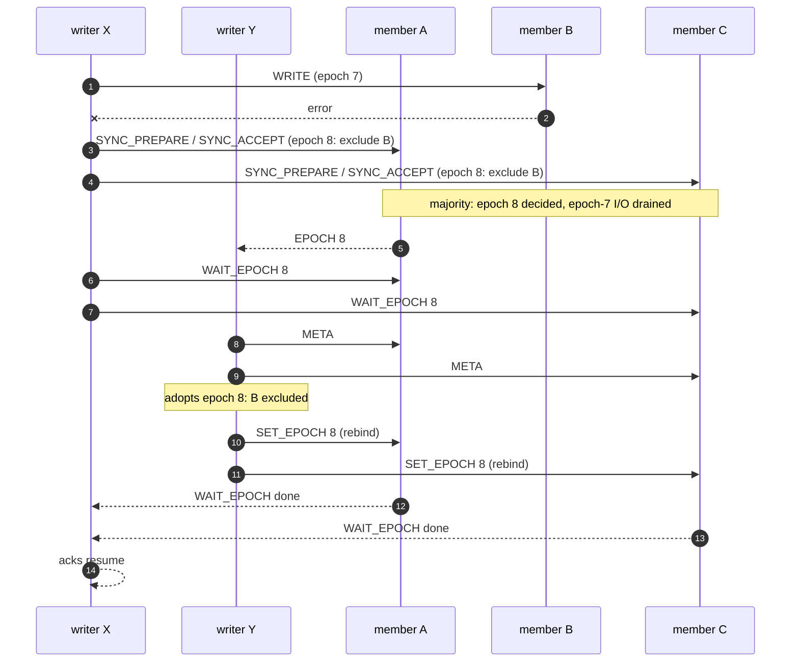

# Multi-attach: several writers of one mirrored object

## Status

Legend: ✅ implemented · 🟡 partial · ❌ not implemented yet. Checked against
the code on 2026-10-07. *Stage* is this document's own numbering (see
*Implementation stages*); [Mirroring](mirroring.md) and
[MDS design](mds.md) number their stages separately.

| Feature | Stage | Status | Where |
|---|---|---|---|
| Chunk record: roles, ballots, `lost`, `resync_owner` | 1 | ❌ | — |
| Bound sessions, `SET_EPOCH` bind/unbind, `lost` on an unclean loss | 1 | ❌ | — |
| `SYNC_PREPARE` / `SYNC_ACCEPT` register for configuration transitions | 1 | ❌ | — |
| `-ESTALE` fencing, drain on epoch change, `EPOCH` notification, `WAIT_EPOCH` | 1 | ❌ | — |
| `PING` and self-fencing of a writer cut off from a majority | 1 | ❌ | — |
| DIRTY/CLEAN per copy with the last clean unbind | 1 | ❌ | — |
| Online resync with several writers (`RESYNC` writes, client-write bitmap) | 1 | ❌ | — |
| Member incarnation: a reconnect to the same incarnation is no F6 | 1 | ❌ | — |
| Public C API: binding, register relay, notification callback | 1 | ❌ | — |
| Resync owner takeover | 2 | ❌ | — |
| Witness vote in transitions (N = 2, several writers) | 3 | ❌ | waits for the witness, [MDS design](mds.md#witness-stage-3) stage 3 |
| Multi-Paxos shortcut, group commit of record writes, per-read epoch check | 4 | ❌ | — |

## Overview

A **writer** is one open of a mirrored chunk for writing. Every open is
one: several threads of one process (every virtqueue of a multiqueue
`rawstor-vhost`/`rawstor-vduse` device opens the object on its own),
several processes, several hosts (a cluster filesystem on a shared disk,
the two ends of a live migration). Nothing in the protocol depends on
which of these it is.

There is no primary: no member, server or client is the place every write
goes through (unlike Ceph's primary OSD). Data fans out from each writer
straight to the members, as with one writer; only the rare **control
transitions** -- membership changes, resync -- are agreed on, and they are
agreed on through the members themselves.

Stage 1 is the minimal scheme that is correct for any number of writers.
It makes every change to the wire protocol, the stored record and the
public C API this design needs; later stages only add behavior on top of
them.

---

## Requirements

| # | Requirement | What breaks without it |
|---|---|---|
| A1 | One sync set at a time: a transition (degrade, rejoin, resync start, an exclusion first recorded at open) is decided once, and every writer builds on the decided record | Two writers each write their own new `sync_id`; the copies end up on sibling sync sets, and the next open refuses with `ENOTRECOVERABLE` (split brain) |
| A2 | `CLEAN` only once every writer left cleanly | A writer that crashed while others went on left copies that differ in its unacknowledged regions; a `CLEAN` mark hides that from the next open (no F5 resync) |
| A3 | No writer acknowledges a write against a configuration that is no longer current | A writer that did not see an exclusion keeps writing to the excluded copy and later bumps from the old `sync_id`; with N = 2 and an asymmetric failure (X loses B, Y loses A) both go on on different copies: split brain of acknowledged data |
| A4 | No writer reads from a copy another writer excluded | X excludes B and acknowledges writes on the others only; Y, which still reaches B, reads the old data from it |
| A5 | A rejoining member gets every writer's writes, and the sweeper never overwrites one of them | The member joins without some writes: silent corruption |

Overlapping writes in flight at once (two writes to the same blocks, the
second issued before the first completed, from one writer or several)
leave those blocks unspecified, and the copies may differ there: each copy
applies them in its own order. A guest never relies on that (page-cache
writeback never has two writes of one page in flight), and a cluster
filesystem serializes them through its lock manager.

---

## Model

- **Writer.** One open for writing; it draws a random nonzero 64-bit
  **writer id**. A READONLY open is not a writer.
- **Member.** One copy of a chunk, served by exactly one process: a
  `rawstor-ost` for its own local locations, or a client for a
  `file://`/`lvm://`/`zfs://` location it opens directly. That process
  keeps the member's **stored record** and, in memory, the member's
  **sessions**. Several processes writing the same copy directly, not
  through one `rawstor-ost`, are out of scope: nothing could fence them.
- **Voting members** are the data members of the chunk (and its witness
  once there is one, stage 3).
- **Ballot**: `(counter, writer id)`, compared lexicographically, so two
  attempts never share one.

## The chunk record

What every member stores for a chunk, next to its data (`meta_encode()`:
the `.meta` file of `file://`, the ZFS user property `rawstor:meta`, the
LVM tag `rawstor.meta=...`), written with fsync before the reply:

| Field | Meaning |
|-------|---------|
| `state` | `CLEAN` \| `DIRTY` \| `SYNCING` -- this copy's own state |
| `epoch` | Configuration version; changes exactly when `roles` or `resync_owner` do. The fencing token |
| `sync_id`, `sync_id_history[4]` | The sync set, as in [Mirroring](mirroring.md#per-copy-metadata); changes together with `epoch` |
| `roles` | One letter per member of the chunk, target-list order: `I` in-sync, `S` syncing, `X` excluded. Every member stores the roles of **all** members, so any writer reconstructs the configuration from a majority of records |
| `resync_owner` | Writer id running the resync of the `S` member, 0 when none |
| `promised` | Highest ballot this member promised |
| `accepted` | Ballot under which `epoch`/`sync_id`/`roles`/`resync_owner` were accepted |
| `lost` | A writer left this copy without unbinding while it was `DIRTY` (see *Sessions*) |
| identity | `member_role`, `width`, `chunk_size` |

Encoding: positional, colon-separated hex fields without key names, the
character set valid in LVM tags and ZFS properties. The record changes in
place: no release has shipped its format. At width 255 it takes about 470
bytes, a typical 3-way chunk about 190; `META_MAX_SIZE` (the fixed `.meta`
record) is 1024. Writer ids are never stored: who is attached is the
members' in-memory sessions, and what a lost writer leaves behind is
`lost`.

## Sessions

A member keeps, in memory, the **bound sessions** of each chunk: which
connection is bound, for which writer id, at which epoch. Its **current
epoch** is the epoch of the highest record it accepted. It also has an
**incarnation**, a random id drawn when its process starts.

- **Bind** (`SET_EPOCH`, flag `BIND`): a writer binds every session it
  writes through, with the epoch of the configuration it uses, before its
  first I/O on it. A bind below the member's current epoch fails with
  `-ESTALE`. The reply carries the record and the incarnation.
- **I/O is fenced**: `READ`, `WRITE`, `DISCARD`, `WRITE_ZEROES` and `FLUSH`
  on a session bound below the current epoch fail with `-ESTALE`. A
  session that never bound (a READONLY open, a single-member chunk) is not
  fenced. Cost: one comparison in the member's memory.
- **Unbind** (`SET_EPOCH`, flag `UNBIND`, plus `CLEAN` after a flushed
  close): the session leaves. If it was the last bound session of the
  chunk on this member, it asked for `CLEAN`, and `lost` is clear, the
  member marks itself `CLEAN` (fsync) before replying.
- **An unclean loss** -- a bound session gone without unbinding (the
  writer crashed, its connection broke, it was cut off) -- of the last
  session a writer id had on the chunk, while the copy is `DIRTY`, sets
  `lost` (fsync). `lost` blocks `CLEAN`: the next open finds a `DIRTY`
  copy and runs F5 ([Mirroring](mirroring.md#failure-cases)), whose
  rejoin transitions rewrite the records with `lost` clear.
- **DIRTY**: before acknowledging its first write, a writer marks every
  in-sync member it writes to `DIRTY` (`SET_EPOCH`, flag `DIRTY`; fsync),
  unless the bind reply already said `DIRTY`. DIRTY and CLEAN are a copy's
  own state, not configuration: they go through no consensus and never
  change `epoch`.

## Transitions: a register per chunk (CASPaxos)

Configuration -- `roles`, `resync_owner`, with their `epoch` and
`sync_id` -- changes only through a single-value register replicated over
the voting members. A plain compare-and-swap on each member would not do:
two writers can each win on a different minority with the same new version
and different content, and no later reader could tell which one a majority
holds.

1. **SYNC_PREPARE(ballot)** to every reachable voting member. A member
   promises (persists `promised = ballot`) if the ballot is higher than
   anything it promised, and returns its record.
2. With promises from a **majority**, the writer takes the record with the
   highest `accepted` among the replies, applies its change to it, and
   sends **SYNC_ACCEPT(ballot, record)**. A change is a pure function of
   the record: "exclude member 2", "member 1 → `S`, owner w", "member 1 →
   `I`". Every change moves `epoch` and `sync_id` (the old `sync_id` into
   the history).
3. The transition is decided once a majority accepted it.

A rejection returns the higher promise seen; the writer re-reads and
retries with a higher counter, re-evaluating whether its change is still
needed -- often another writer already made it. Both phases persist with
fsync before replying.

The transitions:

- **Exclusion**: a write, read-repair or session failure on a member (F1,
  F2, F6), and a member left out at open without its own record proving
  it stale (unreachable, or excluded by size), recorded before the first
  write is acknowledged, as in
  [Mirroring](mirroring.md#when-sync_id-changes).
- **Resync start** and **rejoin** (*Resync*).
- `rawstor resolve` keeps overwriting the records directly
  (`SET_SYNC_STATE`): it is the operator's tool for a split brain, run
  with no writer attached.

**N = 2.** No exclusion reaches a majority with one of two members gone.
It is still decided on the lone survivor when that survivor has exactly
one writer bound -- the deciding one: the accept carries the flag
`ALONE`, which the member refuses (`-EBUSY`) if any other writer is bound.
No other writer can attach meanwhile: an open needs both members. With
several writers bound, writes freeze (`EIO`) until the member is back;
stage 3's witness supplies the third vote that lets them go on.

## Fencing and adoption

When a member accepts a record with a higher epoch, it first drains the
I/O it admitted under the older one, so nothing stamped with the old
configuration lands after the new one is in force, then replies, then
sends an **`EPOCH` notification** -- a frame of its own, not a reply -- on
every session bound below the new epoch.

A writer that gets `-ESTALE` or an `EPOCH` notification **adopts**:

1. It holds back acknowledgements and new I/O.
2. It reads the records of a majority (`META`) and takes the one with the
   highest `accepted`.
3. It applies that configuration -- exclusions, a member to duplicate onto,
   a member that rejoined -- and rebinds every session at the new epoch.
4. It retries the I/O that failed with `-ESTALE` and lets the rest go.

**The writer that decided a transition waits for everyone else to
adopt** before acknowledging anything under the new configuration: it
sends **`WAIT_EPOCH(epoch)`** to every voting member it reaches, and each
replies once no session of the chunk is bound below that epoch any more --
every writer rebound, or its session gone. This is what makes A3 and A4
hold:

- A write needs every member its writer believes in-sync; after a decided
  change every such writer has either adopted it or lost its sessions to
  a majority.
- A writer still bound at the old epoch to a member of the deciding
  majority holds the transition up until it adopts; it learns about it
  from the notification on that very session, whether it only reads or
  also writes.

**Self-fencing.** A writer serves no I/O at all, reads included, while it
is not bound on a majority of the voting members. It sends a **`PING`**
on every bound session that saw no traffic for `fence_interval`, and
counts a session as lost once one went unanswered for `fence_interval`. A
member unbinds a session that sent nothing for `2 × fence_interval` --
counted as an unclean loss. A writer cut off from the majority therefore
stops serving before that majority stops waiting for it. The rule relies
on both sides measuring intervals at about the same rate, not on clocks
agreeing; `fence_interval` defaults to the TCP user timeout.

**Incarnation.** A writer that loses a session to a member and reconnects
to the same incarnation lost nothing from that member's page cache: it
rebinds and retries, and the member is not excluded. A changed incarnation
is a restart, which may have dropped acknowledged writes (F6): the member
is excluded. Many writers times many members make many sessions; this
keeps a single broken connection from changing the configuration.

## Resync

- **Start** is a transition: "member m → `S`, `resync_owner` = w",
  decided by the writer w that found m stale and reachable. It moves the
  epoch, so every writer adopts it and, from then on, duplicates its writes
  onto m (binding a session to m first if it had none). The owner's sweep
  waits for `WAIT_EPOCH` like any decider: once it returns, every write
  in flight from before started under the old epoch has drained, and every
  new one reaches m.
- **The sweep** copies the regions from an in-sync source with writes
  flagged **`RESYNC`** (on `WRITE`/`WRITE_ZEROES`). While a member is
  `SYNCING` it records, in memory, the sectors (512 bytes) client writes
  reached since the `SYNCING` mark -- sparsely, per touched region, so the
  record grows with what was written, not with the chunk -- and applies a
  `RESYNC` write only to sectors not in it. The sweeper therefore never
  overwrites a fresher client write of any writer, partial blocks
  included, with no lock between writers.
- **Rejoin** is a transition: "member m → `I`, `resync_owner` = 0", which
  also clears `lost` on the records it writes. The member's own record is
  written by the same accept, so it holds the new `sync_id`; its `state`
  becomes `DIRTY` if any writer is bound to it, `CLEAN` otherwise.
- **F5** ([Mirroring](mirroring.md#failure-cases)): an open that finds
  copies `DIRTY` with no writer bound, or a writer that finds `lost` set
  when it binds or reads the records, resyncs every member but the first
  in-sync one, one at a time, while the other writers go on.
- An owner that disappears leaves the member `S`; any writer may abort the
  resync with a transition "m → `X`, `resync_owner` = 0" when the owner has
  no session bound on a majority. Taking the resync over without starting
  again is stage 2.

---

## Protocol and ABI changes

All in stage 1. There is no wire version field; an old peer answers
`-ENOSYS` to the new opcodes.

- `include/rawstor/protocol.h`:
  - `SET_EPOCH` `{object_id, chunk_offset, epoch, writer_id, flags}`,
    flags `BIND`, `UNBIND`, `CLEAN`, `DIRTY`; the reply carries the record
    and the incarnation.
  - `SYNC_PREPARE` `{object_id, chunk_offset, ballot}` and `SYNC_ACCEPT`
    `{object_id, chunk_offset, ballot, record, flags}` (flag `ALONE`), in
    the shared-metadata range next to `META`/`SET_SYNC_STATE`; both reply
    with the record, a rejection with the higher promise.
  - `WAIT_EPOCH` `{object_id, chunk_offset, epoch}`.
  - `PING`.
  - `EPOCH` notification `{object_id, chunk_offset, epoch}`, sent by a
    member with `cid` 0, which no request uses.
  - `META` reply: the whole record, the count of bound writers, the
    incarnation.
  - `-ESTALE` on fenced I/O; flag `RESYNC` on `WRITE`/`WRITE_ZEROES`.
- `include/rawstor/target.h`: `RawstorObjectSyncState` carries `roles`,
  `resync_owner`, `lost`, `promised`, `accepted`; `RawstorObjectMeta` the
  bound writer count and the incarnation. Relays for `rawstor-ost`, each
  applying the command to one member of a target, like
  `rawstor_target_set_member_sync_state()` does today:
  `rawstor_target_sync_prepare()`, `rawstor_target_sync_accept()`.
- `include/rawstor/object.h`, also for `rawstor-ost`, which serves a
  remote writer's session through an object it opens on its local
  location: `rawstor_object_set_epoch()` (bind/unbind/DIRTY on behalf of a
  writer id), `rawstor_object_wait_epoch()`, and
  `rawstor_object_set_epoch_callback()` (the member's `EPOCH`
  notification, for the server to forward on the writer's connection).

## Code

- `src/`: the member side -- record, bound sessions, fencing, drain,
  notifications, `WAIT_EPOCH`, the `SYNCING` bitmap, incarnation -- in the
  storage layer every direct location (`file://`, `lvm://`, `zfs://`)
  goes through, keyed by location, object and chunk within the process
  serving it. The writer side in `Chunk`: bind, adoption, the register
  client, `WAIT_EPOCH` after each decision, self-fencing and `PING`, the
  resync owner.
- `ost/`: the new commands, each relayed to the member through the public
  C API, and `EPOCH` notifications forwarded on the writer's connection.
- `src/blk_backend.cpp`: the record's encoding; `META_MAX_SIZE` = 1024.
- `cli/`: `rawstor show -v` prints roles, `lost` and bound writers.
- [Mirroring](mirroring.md) is rewritten to describe this as the one model
  (one writer is the case of a single bound session).

## Implementation stages

1. **The minimal scheme**: everything marked stage 1 above. Correct for any
   number of writers; at N = 2, writes freeze while several writers are
   bound and a member is gone.
2. **Resync owner takeover**: another writer resumes a resync whose owner
   disappeared, from the member's state, instead of starting over.
3. **Witness vote** in transitions for N = 2 with several writers
   (together with [MDS](mds.md) stage 3).
4. **Cost**: the decider of a chunk's last transition skips `SYNC_PREPARE`
   for its next (multi-Paxos); a member writes concurrent record updates
   in one fsync; an optional epoch check on reads for deployments that
   prefer it to the self-fencing timer.
