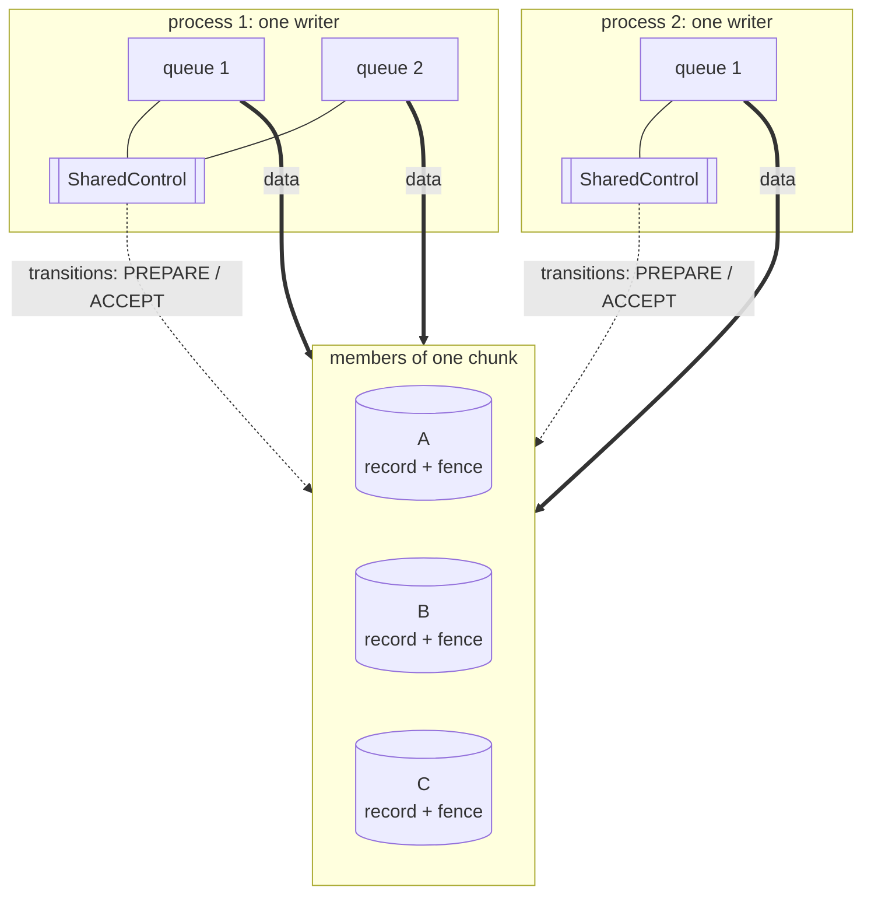
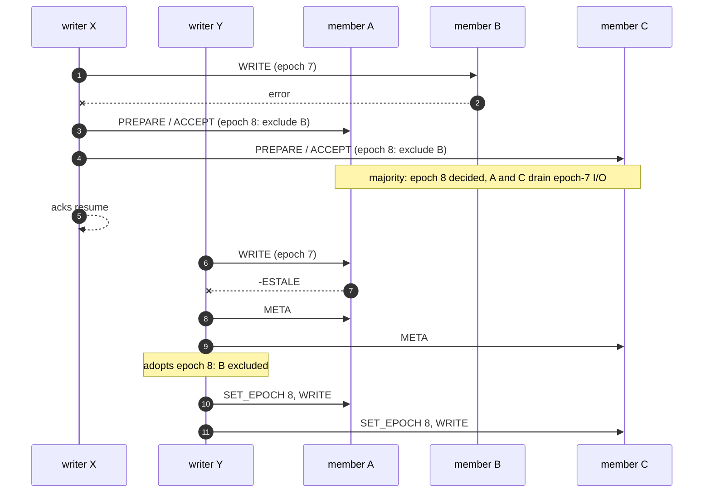

# Multi-attach: several writer processes of one mirrored object

## Status

Legend: ✅ implemented · 🟡 partial · ❌ not implemented yet. Checked against
the code on 2026-10-07. *Stage* is this document's own numbering (see
*Implementation stages*); [Mirroring](mirroring.md) and
[MDS design](mds.md) number their stages separately.

| Feature | Stage | Status | Where |
|---|---|---|---|
| Several queues of one process as one writer, online resync included | 1 | ✅ | [Mirroring](mirroring.md#several-queues-of-one-process) |
| Chunk record: roles, writer set, ballots; positional encoding | 2 | ❌ | `META_MAX_SIZE` is 400 (`src/blk_backend.hpp`) |
| `SYNC_PREPARE` / `SYNC_ACCEPT` register | 2 | ❌ | — |
| Writer set as DIRTY/CLEAN | 2 | ❌ | — |
| `vgcreate --metadatasize 16m` recommendation | 2 | ❌ | — |
| `SET_EPOCH`, `-ESTALE` fencing, drain on epoch change | 3 | ❌ | — |
| `RESYNC` writes and the SYNCING client-write bitmap on the member | 4 | ❌ | — |
| Resync owner takeover, writer liveness from bound sessions | 4 | ❌ | — |
| Witness vote in transitions (N = 2, several processes) | 5 | ❌ | waits for the witness, [MDS design](mds.md#witness-stage-3) stage 3 |
| Member incarnation in `META`, F6 refinement | 6 | ❌ | — |

## Overview

[Mirroring](mirroring.md) has one writer process per object; the queues of
that process share one control state and act as that one writer. This
document is about several **processes**, possibly on different hosts,
writing the same object: a cluster filesystem on a shared disk, and briefly
every live migration (source and destination `rawstor-vhost` both hold the
object open).

There is no primary: no member, server or client is the place every write
goes through (unlike Ceph's primary OSD). Data fans out from each writer
straight to the members, as within one process; only the rare **control
transitions** (membership changes, resync, DIRTY/CLEAN) are agreed on, and
they are agreed on through the members themselves.

---

## Requirements

The control state of one process is the only thing that keeps its queues
consistent; processes share none. Whatever they agree on through the
members must give:

| # | Requirement | What breaks without it |
|---|---|---|
| A1 | One sync set at a time: a transition (degrade, rejoin, first write of a degraded open) is decided once, and every writer builds on the decided record | Two writers each write their own new `sync_id`; the copies end up on sibling sync sets, and the next open refuses with `ENOTRECOVERABLE` (split brain) |
| A2 | `CLEAN` only once no writer has the chunk open | A crash of a writer still open is invisible at the next open (no F5 resync): silent divergence |
| A3 | An exclusion holds for every writer before any of them acknowledges a write without the excluded member | A writer that did not see it keeps writing to the excluded copy and later bumps from the old `sync_id`; with N = 2 and an asymmetric failure (X loses B, Y loses A) both continue on different copies: split brain of acknowledged data |
| A4 | A rejoining member gets every writer's writes: all of them duplicate onto it, and the sweeper never overwrites one of them | The member joins without some writes: silent corruption |

Overlapping writes in flight at once follow the rule of
[Mirroring](mirroring.md#model-and-assumptions) across processes too: their
blocks are unspecified, and the copies may differ there.

---

## Principles

1. **Data path without a leader.** A writer fans its writes out to the
   members itself. Nothing on the hot path talks to anything but the
   members.
2. **Control transitions are agreed on, through the members.** Membership
   changes, the start and end of a resync, and DIRTY/CLEAN are rare; each
   is a decision on a small per-chunk record that every member stores.
3. **The configuration version is the fencing token.** `epoch` and
   `sync_id` change **only when the membership or a member's role
   changes**: a degrade, a rejoin, an exclusion first recorded by the dirty
   gate ([Mirroring](mirroring.md#when-sync_id-changes)), and a resync
   start, which changes a member's role. DIRTY/CLEAN and writer joins never
   touch them. A member refuses I/O stamped with an older epoch, so a
   writer can never acknowledge a write against a picture of the mirror
   set that is no longer current.
4. **The writer is the process.** All queues of one process are one
   writer ([Mirroring](mirroring.md#several-queues-of-one-process)) and
   present a single writer id to the members.

---

## The chunk record

Every member's record of a chunk (`meta_encode()`: `.meta` file for
`file://`, ZFS user property `rawstor:meta`, LVM tag `rawstor.meta=...`)
carries, beyond what [Mirroring](mirroring.md#per-copy-metadata) lists:

| Field | Meaning |
|-------|---------|
| `roles` | One letter per member of the chunk, target-list order: `I` in-sync, `S` syncing, `X` excluded. Every member stores the roles of **all** members, so any writer reconstructs the whole configuration from a quorum of records |
| `resync_owner` | Writer id running the resync of the `S` member, 0 when none |
| `writers` | Writer ids of the processes that have the chunk open for writing, at most 8. DIRTY ⇔ non-empty |
| `promised` | Highest ballot this member promised (register, below) |
| `accepted` | Ballot under which the current record was accepted |

`epoch` is the configuration version and the fencing token.

A ballot is `(counter, writer id)`, compared lexicographically, so two
attempts never share one. A writer id is a random nonzero 64-bit value
drawn once per process.

Encoding: positional, colon-separated hex fields without key names
(`<state>:<epoch>:<sync_id>:<h0>,<h1>,<h2>,<h3>:<roles>:<resync_owner>:<w0>,...:<promised>:<accepted>:<member_role>:<width>:<chunk_size>`),
the character set valid in LVM tags and ZFS properties. The record format
changes in place: no release has shipped it.

### Size limits

| Backend | Limit | Record |
|---------|-------|--------|
| ZFS user property | value ≤ 8192 bytes (`zfsprops(7)`) | fits |
| LVM tag | no per-tag limit (`validate_tag()` has none), but every tag lives in the VG metadata text, which must fit in about half of the metadata area (≈ 510 KiB with the default ≈ 1 MiB area) | fits; see below |
| `file://` `.meta` | fixed record of `META_MAX_SIZE` | 1024 bytes |

Record sizes: 164 bytes for a typical 3-way chunk with one writer, 215
bytes with 4 writers, 365 bytes for width 16 with 8 writers, 604 bytes at
the extreme (width 255, 8 writers) — dropping the key names keeps the
typical record as small as the keyed one without the new fields (172
bytes), so the typical LVM VG metadata footprint does not grow. A VG
holding many chunks is bounded by its metadata area regardless of this
record (a plain linear LV is itself a few hundred bytes of VG metadata
text), so rawstor VGs are to be created with `vgcreate --metadatasize
16m`, which the README recommends from stage 2 on. Every record update
rewrites the whole VG
metadata (and archives a copy), which is acceptable because record updates
happen only at open, close and transitions.

---

## Transitions: a register per chunk (CASPaxos)

A plain compare-and-swap on each member is not enough: two writers can
each win on a different minority with the same new version and different
content, and no later reader can tell which one a majority holds. Each
chunk's record is therefore a single-value register replicated over its
members with the CASPaxos protocol:

1. **PREPARE(ballot)** to every reachable member. A member promises
   (persists `promised = ballot`) if the ballot is higher than anything it
   promised, and returns its record with `accepted`.
2. With promises from a **majority of the voting members**, the writer
   takes the record with the highest `accepted` ballot among the replies,
   applies its change to it (a pure function: "exclude member 2", "add
   writer w", "member 1 → SYNCING, owner w"...) and sends
   **ACCEPT(ballot, record)**.
3. The transition is decided once a majority accepted it.

A rejection (a higher promise seen) returns the competing ballot; the
writer re-reads and retries with a higher counter, re-evaluating whether
its change is still needed (often another writer already made it). The
writer that decided the previous transition of a chunk keeps its ballot
and skips PREPARE for the next one (the multi-Paxos shortcut), so the
common case is one record write per member.

Both phases persist with fsync before answering (record writes are
durable: `.meta` `pwrite(..., sync)`, `zfs set`, `lvchange`).

**Voting members** are the data members of the chunk plus its witness
when one is configured ([MDS](mds.md), stage 3). An excluded or syncing
member still votes: its record is as durable as any other, and the
majority intersection is what makes a decision unique.

**Single-writer exception (N = 2).** When `writers` holds only the
deciding writer, a degrade may be decided on the lone survivor
([Mirroring](mirroring.md#quorum-excluding-split-brain-by-construction)).
The register still protects it: another process joining must first get its
join accepted by a majority, which for N = 2 is both members, so the
survivor's record version moves and the single-writer degrade's ACCEPT is
rejected.

**N = 2 with several writer processes and no witness:** a degrade cannot
reach a majority, so writes freeze (`EIO`) until the failed member is
back. With a witness, the witness supplies the third vote synchronously
for that transition. This makes the witness a synchronous participant of
the degrade **only when several processes are attached**; the
single-writer path keeps [MDS](mds.md)'s rule that the witness is off the
failure hot path.

## Fencing on the members

- A session binds to the chunk with **`SET_EPOCH`** (new opcode):
  `{object_id, chunk_offset, epoch, writer_id}`, sent after the open and
  after every adoption of a newer configuration.
- The member keeps the chunk's current epoch in memory (the epoch of the
  highest accepted record). `READ`, `WRITE`, `DISCARD`, `WRITE_ZEROES` and
  `FLUSH` from a session bound to an older epoch fail with **`-ESTALE`**.
  Cost on the hot path: one in-memory comparison on the member, no change
  to the I/O frames.
- An ACCEPT that raises the epoch completes only after the member drained
  the I/O it admitted under the older epoch: no write stamped with the old
  configuration lands after the new one is in force.
- On `-ESTALE` a writer suspends acknowledgements, reads the register from
  a majority (PREPARE-less read: `META`), adopts the configuration
  (exclusions, a SYNCING member to duplicate onto, a new resync owner),
  rebinds its sessions and retries the I/O.

Why this is enough: an acknowledgement needs every member the writer
believes in-sync; a decided configuration change is accepted by a majority
of voting members, and for N ≥ 3 any set of in-sync members a writer may
still write to (> N/2, or writes are frozen) intersects that majority. For
the N = 2 single-writer exception the survivor itself holds the new
epoch. So at least one member a stale writer needs refuses it.

## DIRTY/CLEAN: the writer set

- **Open for write** = a transition "add my writer id to `writers`". It
  stands for the first-write DIRTY mark, so the write path has no dirty
  gate.
- **Close** = "remove my writer id"; the transition that empties
  `writers` sets `state = CLEAN`. At most 8 writers per chunk; the ninth
  open fails with `-EUSERS`.
- **Liveness without clocks.** `META` additionally returns, from the
  member's memory, the writer ids that currently hold a bound session
  (`SET_EPOCH`) on it. A writer id in `writers` that is bound on none of a
  majority of members is **dead**: the next writer to notice runs
  "remove w" together with "every member but the first in-sync one →
  resync" (F5, for the dead writer's unacknowledged writes). A writer that
  was only partitioned finds its id gone at its next adoption and
  re-opens with a fresh id.
- Writer-set changes do not change `epoch`: they never fence anybody.

## Resync across processes

- Starting a resync is a transition: "member m → `S`, `resync_owner` =
  w". It raises the epoch, so every writer learns via `-ESTALE` that it
  must duplicate its writes onto m.
- The owner sweeps. Its copy writes carry a **`RESYNC`** flag on
  `WRITE`/`WRITE_ZEROES`. While a member is SYNCING it keeps in memory a
  4 KiB-granular bitmap of blocks written by client writes since the
  SYNCING mark, and applies a `RESYNC` write only to blocks not in it.
  The sweeper therefore never overwrites a fresher client write of any
  process, with no lock between processes; inside one process the region
  lock of [Mirroring](mirroring.md#online-resync-with-several-queues)
  applies as well.
- Completion is a transition "m → `I`, `resync_owner` = 0", again
  raising the epoch.
- A dead or partitioned owner (by the liveness rule above) is replaced by
  a transition "`resync_owner` = me" from any writer; the new owner starts
  over (as F8).

## Session loss while DIRTY (F6) with many sessions

N queues times M members multiply sessions, and F6 turns every lost
session into a degrade. `META` additionally returns the member's
**incarnation** (a random id drawn at server start). A session lost and
re-established to the same incarnation lost nothing from the page cache
and does not degrade the member; a changed incarnation does, as F6
prescribes.

---

## Protocol and code changes

- `include/rawstor/protocol.h`:
  - `SYNC_PREPARE`, `SYNC_ACCEPT` (shared-metadata range, next to
    `META`/`SET_SYNC_STATE`), carrying a ballot and a record;
    `SET_SYNC_STATE` stays for `rawstor resolve` and tests;
  - `SET_EPOCH` `{object_id, chunk_offset, epoch, writer_id}`;
  - `META` response: `roles`, `resync_owner`, `writers`, `promised`,
    `accepted`, live writer ids, incarnation;
  - `-ESTALE` on fenced I/O; `RESYNC` flag on `WRITE`/`WRITE_ZEROES`.
- `src/blk_backend.cpp`: the record's encoding; `META_MAX_SIZE` = 1024.
- `ost/`: register handlers, per-chunk epoch fence and drain, session
  writer ids, SYNCING client-write bitmap, incarnation.
- `src/chunk.cpp`: register client, adoption on `-ESTALE`, writer set,
  liveness check, resync ownership across processes.
- `README.md`: `vgcreate --metadatasize 16m` for `lvm://` locations.

## Implementation stages

1. **One process, several queues** — implemented, see
   [Mirroring](mirroring.md#several-queues-of-one-process).
2. **The record and the register:** fields, `SYNC_PREPARE`/`SYNC_ACCEPT`,
   all transitions through the register, writer set in place of the
   first-write DIRTY mark.
3. **Fencing:** `SET_EPOCH`, `-ESTALE`, drain on epoch change, adoption.
4. **Cross-process resync:** `RESYNC` writes, the SYNCING bitmap on the
   member, owner takeover; liveness of writer ids.
5. **Witness vote in transitions** for N = 2 with several processes
   (together with [MDS](mds.md) stage 3).
6. **Incarnation** in `META` and the F6 refinement.
