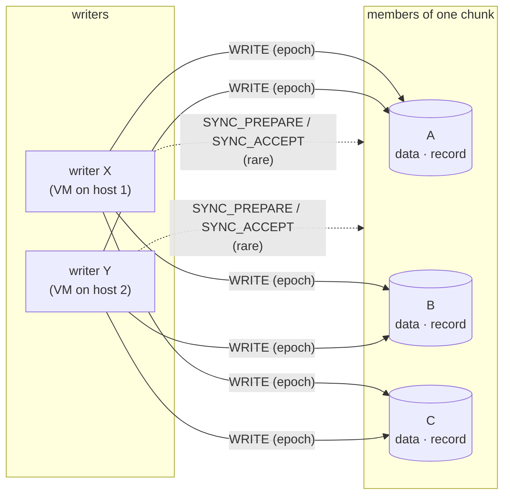
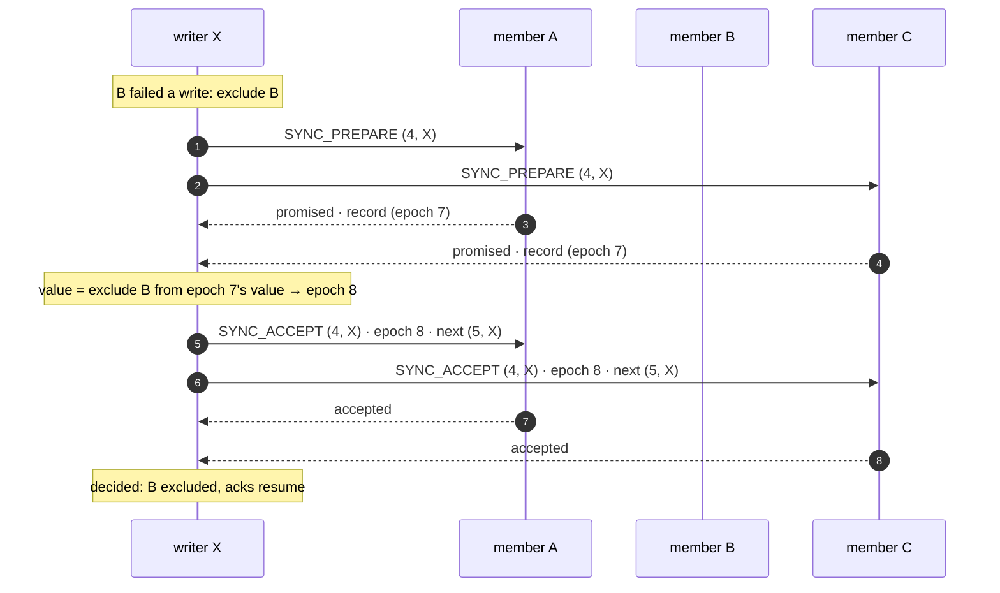
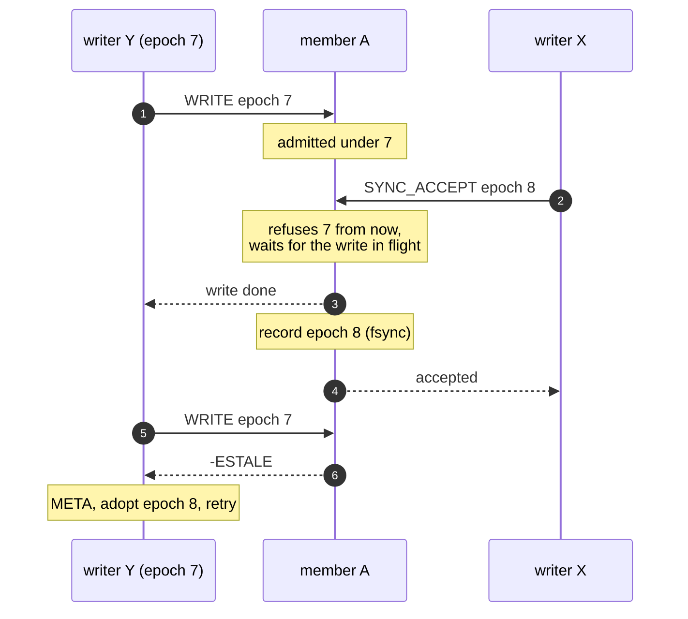
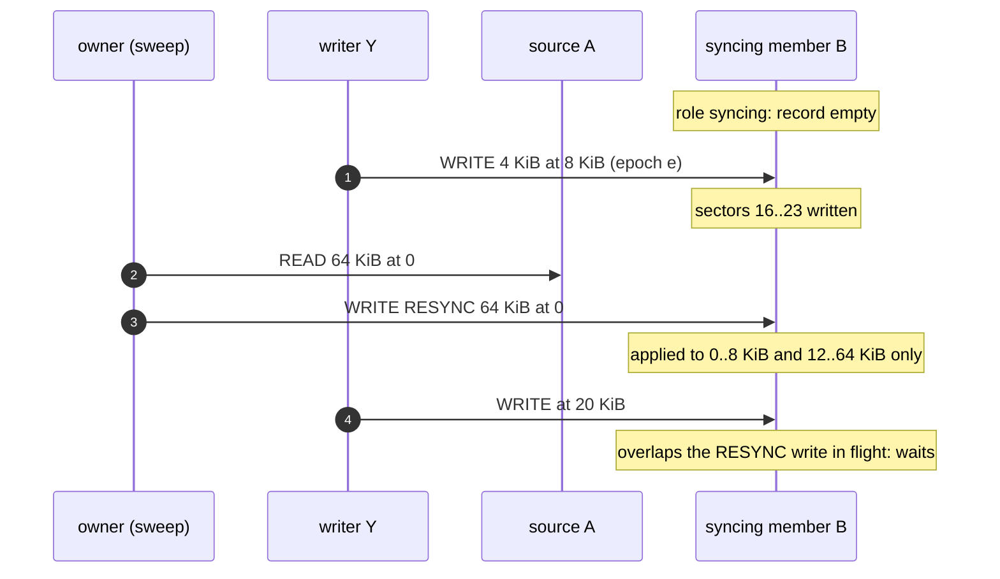

# Multi-attach: several writers of one mirrored object

## Status

Legend: ✅ implemented · 🟡 partial · ❌ not implemented yet. *Stage* is this
document's own numbering (see *Implementation stages*);
[Mirroring](mirroring.md) and [MDS design](mds.md) number their stages
separately.

| Feature | Stage | Status | Where |
|---|---|---|---|
| Writable opens of one process share the chunk's state; transitions once per process | 1 | ✅ | [Mirroring](mirroring.md#writers), `src/chunk.cpp` (`MirrorControl`) |
| Acceptor rules (`rawstd::caspaxos::prepare()` / `accept()`) | 1 | ✅ | `librawstd/include/rawstd/caspaxos.hpp`, [CASPaxos](caspaxos.md) |
| A copy's record carries the register: `promised`, `accepted`, and `resync_owner` in the configuration | 1 | ✅ | `src/blk_backend.cpp` (`meta_encode()`) |
| `SYNC_PREPARE` / `SYNC_ACCEPT` on every member, reply carries the actual record; `ALONE` | 1 | ✅ | `src/blk_backend.cpp`, `ost/src/client.cpp` (`_sync`), `rawstor_target_sync_prepare()` / `_accept()` |
| One record lock and one writer count per copy in a process (`LocalMember`) | 1 | ✅ | `src/local_member.hpp` |
| Copies keep their own `DIRTY` / `CLEAN`; `LOST`; `LEAVE`; `rawstor_object_abandon()` | 1 | ✅ | [Mirroring](mirroring.md#dirty-clean-and-lost) |
| Live writer count in `META` | 1 | ✅ | `RawstorObjectMeta.writers` |
| A `rawstor-ost` is one copy; with several locations it keeps no record of it | 1 | ✅ | [Mirroring](mirroring.md#one-copy-per-server) |
| Syncing is a role, not a `state`; a copy learns its own from its position in the request | 1 | ✅ | [Mirroring](mirroring.md#states-and-roles), `position` in `SET_CONFIG` / `SYNC_ACCEPT` |
| `epoch` on write frames, `-ESTALE` below the copy's epoch, drain on raise | 1 | ✅ | `src/local_member.cpp`, `ost/src/client.cpp` (`Admission`) |
| `RESYNC` flag on writes; client-write record of a syncing copy | 1 | ✅ | `src/local_member.cpp`, `ost/src/client.cpp` (`Resync`) |
| `Proposer<V>`: a change as a coroutine over a pluggable transport | 2 | ❌ | [CASPaxos](caspaxos.md#api) |
| Every transition through the register | 2 | ❌ | the client uses `SET_CONFIG` |
| The client stamps writes with its `epoch`; adoption on `-ESTALE` | 2 | ❌ | the client sends 0 |
| `LOST` at open and at runtime: resync of the losers | 2 | ❌ | open treats `LOST` as `DIRTY` |
| Resync across processes (`resync_owner`, sweep with `RESYNC`) | 2 | ❌ | — |
| `SET_CONFIG` and `rawstor_target_set_member_config()` retired | 2 | ❌ | [Retiring `SET_CONFIG`](#retiring-set_config) |
| The client keeps the register value once per chunk, not per member | 2 | ❌ | [The register](#the-register-caspaxos) |
| A `rawstor-ost` with several locations: one copy with a record of its own | — | ❌ | [Mirroring](mirroring.md#one-copy-per-server) |
| Witness vote for N = 2 with several writer processes | 3 | ❌ | waits for the witness, [MDS design](mds.md#witness-stage-3) stage 3 |

## Overview

A **writer** is a process with the object open for writing: one VM's
`rawstor-vhost`/`rawstor-vduse`, both ends of a live migration for a
moment, every node of a cluster filesystem on a shared disk.

**Stage 1** makes the threads of one process one writer: every virtqueue
of a multiqueue device opens the object on its own thread, and those opens
share one control state per chunk, so they never race each other's
metadata updates on the members ([Mirroring](mirroring.md#writers)). It
also makes every change to the wire protocol, the stored record and the
member's behavior that several writer processes need, so that stage 2 is a
client-side change only: servers are upgraded first. With stage 1 the
client still runs as the one writer process of a chunk: it sets the
configuration with `SET_CONFIG`, makes no transition through the register
and stamps its writes with epoch 0. Several processes writing one object
at once are not supported yet, and nothing refuses them.

**Stage 2** lets several processes write. There is no primary: no member,
server or client is the place every write goes through (unlike Ceph's
primary OSD). Data fans out from each writer straight to the members, as
with one writer. Only the rare **control transitions** -- membership
changes, resync -- are agreed on, through a register the members
themselves hold. `DIRTY` and `CLEAN` are no transition at all: each copy
keeps them by itself, from the sessions it serves.

---

## Requirements

| # | Requirement | What breaks without it | Mechanism | Stage |
|---|---|---|---|---|
| A1 | One sync set at a time: a transition is decided once, and every writer builds on the decided configuration | Two writers each write their own new `sync_id`; the copies end up on sibling sync sets, and the next open refuses with `ENOTRECOVERABLE` (split brain) | The register | members 1, writers 2 |
| A2 | `CLEAN` only once every writer left cleanly; a writer that vanished while writing is never hidden | A writer that crashed while others went on left copies that differ in its unacknowledged regions; a `CLEAN` mark hides that from the next open (no F5 resync) | Copies' own `DIRTY`/`CLEAN`, the writer count, `LEAVE`, `LOST` | 1 |
| A3 | No write is acknowledged against a configuration that misses a member it should reach | A writer that did not see a resync start never duplicates onto the syncing member, which then rejoins without that write | `epoch` on write frames, `-ESTALE` | members 1, writers 2 |
| A4 | A rejoining member gets every writer's writes, and the sweep never overwrites one of them | Silent corruption on the rejoined copy | A3, plus the `RESYNC` flag and the copy's record of client writes | members 1, writers 2 |

Reads are not fenced: a writer may read from a copy another writer has
just excluded, until it learns of the exclusion at its next write or
transition. The excluded copy holds every write acknowledged before it was
excluded, so such a read is at worst slightly stale -- the same as reading
a block another writer is overwriting right now.

Overlapping writes in flight at once (two writes to the same blocks, the
second issued before the first completed, from one writer or several)
leave those blocks unspecified, as in
[Mirroring](mirroring.md#model-and-assumptions). So does a write that
failed: its blocks may hold the new data on some copies and the old on
others until they are written again or resynced.

---

## The member

Each copy of a chunk is a **member**: a `file://`, `lvm://` or `zfs://`
location holding the data and, next to it, the record
([Mirroring](mirroring.md#per-copy-metadata)). Writers reach it directly
(a local location) or through the `rawstor-ost` serving it, which is one
copy to its clients whatever it stores the chunk on
([Mirroring](mirroring.md#one-copy-per-server)).

Every open of one copy in one process -- the sessions `rawstor-ost` serves,
or a client's own direct opens -- shares one `LocalMember`, found by
location, object id and chunk offset. It holds what the member knows in
memory:

| Field | Meaning |
|---|---|
| record lock | Serializes every change of the record (`SET_CONFIG`, `SYNC_PREPARE`, `SYNC_ACCEPT`, the copy's own `DIRTY`/`CLEAN`/`LOST`): read, decide, write back with fsync as one step |
| `writers` | Sessions open for writing on the copy right now; reported in `META` |
| `epoch`, admitted writes | Fencing, *Epoch on writes* |
| written sectors | While the copy's role is syncing, *Resync across processes* |

All of it is lost with the process. That is deliberate: what a crashed
`rawstor-ost` leaves behind is the record alone, and the record is enough
(*Failure scenarios*). The record itself cannot live in memory: an
acceptor must not forget its promises, `sync_id` and its history are how
a copy is told stale across restarts, and `DIRTY`/`LOST` exist to outlive
a crash.

A copy's role is the entry of `roles` at its position among the chunk's
members ([Mirroring](mirroring.md#states-and-roles)). The record does not
store that position: every request that records a configuration
(`SET_CONFIG`, `SYNC_ACCEPT`) carries it for its receiver, which takes its
own role from it as it records the value. The position is the same for
every writer -- the order of a plain target's URIs, of an `mds://`
chunk's placement -- and a `rawstor-ost` passes its client's on to the
copy beneath it, never its own location's index.

## The register (CASPaxos)

The chunk's configuration is a single-value register replicated over its
members with CASPaxos ([CASPaxos](caspaxos.md)). A plain compare-and-swap
on each member is not enough: two writers can each win on a different
minority with the same new version and different content, and no later
reader could tell which one a majority holds.

Every copy's record keeps, next to its own `state`:

| Field | Meaning |
|---|---|
| `promised` | Highest ballot this member promised |
| `accepted` | Ballot under which the value below was accepted |
| value: `epoch` | Configuration version; changes with every transition |
| value: `sync_id`, `sync_id_history[4]` | The sync set, as in [Mirroring](mirroring.md#per-copy-metadata); changes together with `epoch` |
| value: `roles` | One per member of the chunk, in member order: in-sync, syncing, excluded (`RawstorObjectMemberRole`) |
| value: `resync_owner` | Proposer running the resync of the syncing member, 0 when none |

The value is `RawstorObjectConfig`; the ballots are `RawstorObjectMeta`'s
`promised` and `accepted`.

A **ballot** is `(counter, proposer)`, compared lexicographically, so two
attempts never share one. The proposer is a random nonzero 64-bit value a
writer draws once per process; nothing else identifies a writer.

Two requests, each persisted with fsync before the reply:

- **`SYNC_PREPARE(ballot)`**: the member promises if `ballot` is above both
  `promised` and `accepted`.
- **`SYNC_ACCEPT(ballot, value, next)`**: the member accepts if `ballot` is
  not below `promised` and above `accepted`, setting
  `promised = max(ballot, next)`, `accepted = ballot`.

**Every reply carries the member's actual record** -- `promised`,
`accepted`, the value, the live writer count -- whether the request
succeeded or not. A writer changing the configuration:

1. Sends `SYNC_PREPARE` with a ballot above any it has seen, to every
   reachable member, and waits for promises from a majority.
2. Takes the value with the highest `accepted` among the replies -- the
   actual current configuration -- and applies its change to it. The change
   is a function of that value: "exclude member 2", "member 1 → syncing,
   owner w". **If the actual value already has the change -- another
   writer made it -- there is nothing to do**, and the writer adopts that
   value instead.
3. Sends `SYNC_ACCEPT` with the new value; decided once a majority accepted.

A rejection carries the higher `promised` it saw: the writer retries from
step 1 with a higher counter. The writer that decided a chunk's last
transition passes its next ballot as `next` and sends its next
`SYNC_ACCEPT` without `SYNC_PREPARE`: the common case is one record write
per member ([CASPaxos](caspaxos.md#one-round-changes)).

Every member stores the whole value -- that is what replicating the
register means, and it is cheap on disk: `roles` takes one digit per
member. A writer needs it once per chunk, though: it keeps the decided
value in the chunk's shared state (`MirrorControl`) and, per member, only
what is that member's own -- `state`, `epoch`, `sync_id` and its history.
The stage-1 client still keeps a whole configuration per member and makes
no use of the register; stage 2 moves to one value per chunk.

`rawstor-ost` applies both requests to the copy it is, on its one
location; a server with several locations answers `-ENOSYS`
([Mirroring](mirroring.md#one-copy-per-server)).

### Retiring `SET_CONFIG`

`SET_CONFIG` (`rawstor_target_set_member_config()` in the C API) records a
configuration on one copy unconditionally, bypassing the register; it
keeps the copy's ballots, so the stage-1 client's transitions never wipe
promises. With stage 1 it carries every transition of the client -- the
syncing role that starts a copy's record of client writes included -- and
`rawstor resolve`. A write that ignores promises cannot coexist with
several proposers, so stage 2 removes the command and the function once
nothing needs them:

| Use | Stage 2 replacement |
|---|---|
| The client's transitions (dirty gate, exclusion, rejoin) | `SYNC_PREPARE` / `SYNC_ACCEPT` |
| The syncing role | Already a role: an accepted value naming the copy syncing starts its record of client writes, as `SET_CONFIG` does |
| Clearing `LOST` (`RAWSTOR_CONFIG_CLEAR_LOST`) | A rule on the accepted value. Candidate: an accept with a new `sync_id` and every member in-sync clears `LOST` -- that only happens when a resync has just made the copies equal again. To be settled before the removal: clearing `LOST` over copies that still differ would hide them from F5 |
| `rawstor resolve` | `SYNC_PREPARE` with a ballot above every one seen, then `SYNC_ACCEPT` of the resolved configuration: consistent with writers still running |
| pyrawstor `Target.set_member_config()`, tests | The same requests |

The value carries no `state` of the copy itself: `DIRTY`, `CLEAN` and
`LOST` stay the copy's own ([Mirroring](mirroring.md#states-and-roles)).

## Epoch on writes

`WRITE`, `WRITE_ZEROES`, `DISCARD` and `FLUSH` carry the `epoch` of the
configuration the writer uses (`FLUSH` in Basic's `val`). A copy whose
accepted `epoch` is higher refuses the request with `-ESTALE`; `0` is never
refused (a single-member chunk, `rawstor resolve`, the stage-1 client).
Cost on the hot path: two atomic operations in the member's memory.

`rawstor-ost` admits every request of a session on the `LocalMember` of
the copy it is. The member learns its epoch from the record when a
session opens the copy for writing, and raises it whenever a record with
a higher epoch is about to be persisted (`SET_CONFIG`, an accepted
`SYNC_ACCEPT`). Raising refuses the older epoch at once and **waits for
every write admitted under it to complete** before the record is
written, so nothing stamped with the old configuration lands once the
new one is recorded. While it waits it lets go of the record lock -- an
admitted write may need it for the copy's `DIRTY` mark -- and decides on
the record as it finds it once it has the lock back. A server with no
copy of its own -- several locations, or one reached through another
server -- has nothing to fence on, and refuses a stamped request with
`-EOPNOTSUPP` rather than let it through.

With stage 2, a writer that gets `-ESTALE` reads the register from a
majority (`META`), adopts the configuration -- exclusions, a syncing member
to duplicate onto, a rejoined member -- and retries the write. A decided
transition is accepted by a majority, and every write needs every member
its writer believes in-sync; for N ≥ 3 those always intersect, so a writer
can never acknowledge a write against an outdated configuration (A3).
With N = 2, see below.

## Resync across processes

- **Start** is a transition "member m → syncing, `resync_owner` = w". It
  moves the epoch, so every writer learns of it through `-ESTALE` at its
  next write and duplicates its writes onto m from then on.
- **The sweep** copies regions from an in-sync source with writes flagged
  **`RESYNC`**. From the moment m records a configuration naming it
  syncing, its `LocalMember` records the sectors (512 bytes) client
  writes covered whole, and a `RESYNC` write is applied only to the
  sectors not among them; a client write overlapping a `RESYNC` write in
  flight waits for it. The sweep therefore never overwrites a fresher
  client write of any writer, with no lock between writers (A4). A
  `RESYNC` write still answers with its full length. A configuration that
  keeps m syncing keeps the record; any other role drops it.
- **Rejoin** is a transition "m → in-sync, `resync_owner` = 0".
- An owner that disappears leaves m syncing; any writer aborts the resync
  with "m → excluded, `resync_owner` = 0".

The record of client writes lives in memory only. A copy that keeps none
-- not syncing, or syncing since before its `rawstor-ost` started --
refuses a `RESYNC` write with `-ESTALE`: it cannot tell which sectors a
client wrote, and copying over all of them could overwrite one. The owner
then records the syncing role anew, which starts an empty record, and
starts the sweep over. A server with no copy of its own refuses `RESYNC`
with `-EOPNOTSUPP`.

A client write covering a sector only in part leaves that sector to the
sweep. vhost-user and VDUSE devices only issue whole sectors; a writer
that issues partial ones during a resync may see its partial sector
overwritten by the sweep on the syncing copy.

## N = 2

No transition reaches a majority with one of two members gone. An
exclusion is still decided on the lone survivor when the deciding writer
is the only one: the accept carries the flag `ALONE` and the number of
sessions the writer itself has open on that member, and the member refuses
with `-EBUSY` when it counts more sessions open for writing, **or when its
copy is `LOST`**. The second rule matters in a symmetric partition: each
side's member eventually drops the other writer's session and counts only
its own -- but that drop left it `LOST`, so neither side decides alone and
both freeze (`EIO`) instead of splitting the chunk. With several writers,
writes freeze until the member is back; stage 3's witness supplies the
third vote.

---

## Failure scenarios

How each failure is covered. *Stage 1* is what the code does now, with one
writer process per chunk; *Stage 2* is the design with several. F-numbers
refer to [Mirroring](mirroring.md#failure-cases).

### Writers

| Scenario | What the members see | Stage 1 | Stage 2 |
|---|---|---|---|
| The only writer crashes (VM, `rawstor-vhost` killed) | Through `rawstor-ost`: its sessions drop without `LEAVE`, every copy it wrote goes `LOST`. Direct local open: nobody marks, the copies stay `DIRTY` | ✅ Next open: same `sync_id`, not `CLEAN` → F5, served from the first in-sync member | Same, and `LOST` makes the losers' resync mandatory |
| One of several writers crashes | Its sessions drop: the copies it wrote go `LOST`, `writers` drops; the other writers' writes go on | — (one writer) | The copies may differ only in its unacknowledged regions; the next writer to see `LOST` (any `META`, transition or reply) resyncs the losers from the first in-sync member while writes continue. The chunk is never marked `CLEAN` over it |
| A writer closes cleanly while others go on | `LEAVE` on each session, `writers` drops, the copy stays `DIRTY` | ✅ (member side, tested with several sessions) | The last `LEAVE` marks it `CLEAN` |
| A writer hangs (alive, not writing, sessions open) | Nothing: its sessions count | — | Holds `ALONE` off on N = 2 (safe: freeze rather than decide); otherwise harmless |
| A writer's close fails to flush, a write failed outright, or an exclusion is unrecorded | The chunk closes without `LEAVE`: the copies it wrote go `LOST` | ✅ | Same |
| A writer reconnects after a dropped session (F6) | The dropped session left the copy `LOST`; the new one counts in `writers` again | ✅ The writer excludes that member anyway (F6) and resyncs it on rejoin | Same; `LOST` stays until the resync |

### Servers

| Scenario | What happens | Stage 1 | Stage 2 |
|---|---|---|---|
| A `rawstor-ost` crashes or restarts | Its in-memory state is gone (`writers`, epoch admissions, a record of client writes); the record stays as last persisted (`DIRTY`, or `LOST`). Every writer loses its session to it | ✅ F6: the writer excludes it (new `sync_id` on the survivors), rejoins it with a full resync (F7) | Each writer sees the session loss on its own; the first to propose decides the exclusion, the others find it decided in step 2 and adopt it. A writer that reconnected to the restarted member before learning of the exclusion writes at the old epoch: the restarted member accepts it (it knows only its record's epoch), but the survivors refuse it `-ESTALE`, so it is never acknowledged; the member is excluded and resynced anyway |
| A `rawstor-ost` restarts during a resync onto its copy | The copy's role in its record is syncing; its record of client writes is gone | ✅ Stale (F8), resync from scratch | Its `RESYNC` writes are refused `-ESTALE`; its sessions dropped, so the writers exclude it, and the resync starts over with the syncing role recorded anew and an empty record |
| The source of a resync fails | Writes to it fail | ✅ F1 on the source; the resync stops | Exclusion through the register; the owner aborts the resync (m → excluded) |
| Silent page-cache loss on a restart (F6) | Not visible in the record | ✅ Conservative F6 rule | Same, per writer |

### Network

| Scenario | What happens | Stage 1 | Stage 2 |
|---|---|---|---|
| A writer loses one member (N ≥ 3) | Its writes to it fail | ✅ F1: exclude, continue on the majority | The exclusion is a transition: one writer decides, the others get `-ESTALE` at their next write to the survivors and adopt it |
| Partition {X, A} \| {Y, B, C} (N = 3) | X reaches a minority, Y a majority | — | Y excludes A (majority B, C → epoch e+1) and goes on. X cannot reach a majority to exclude B and C: its writes freeze (`EIO`), unacknowledged. Its writes may still land on A at epoch e -- A is excluded, they are resynced away. X's reads from A are stale until it learns of the exclusion (allowed, *Requirements*). After the heal X gets `-ESTALE` from B and C and adopts |
| Partition {X, A} \| {Y, B} (N = 2) | Neither side has a majority | — (one writer: continue on one survivor as in [Mirroring](mirroring.md#known-limitation-two-mirrors-one-survivor)) | Each side's `ALONE` is refused: first while the other writer's session still counts, then because its drop left the copy `LOST`. Both freeze until the partition heals; stage 3's witness lets one side go on |
| Asymmetric: X reaches A, B, C; Y only C (N = 3) | Y's writes to A and B fail | — | Y cannot exclude A and B (no majority): it freezes. Its failed writes may have landed on C only: those regions differ on C until written again -- when Y gives up, its sessions drop and C goes `LOST`, so the divergence is resynced away. X goes on |
| Only the server side of a session hangs (no FIN) | The member keeps counting the session | — | `ALONE` stays refused; no harm otherwise. TCP keepalive / the writer's own reconnect bound how long |
| A reply is lost | The proposer cannot tell whether its request took effect | ✅ (acceptor side: every reply is the record, repeated requests are refused or idempotent) | The proposer retries with a higher ballot; step 2 finds its own change already in the value and adopts it |

### Transitions

| Scenario | What happens | Stage 1 | Stage 2 |
|---|---|---|---|
| Two writers transition at once | Both prepare; ballots are ordered | ✅ acceptor rules | At most one value is decided; the loser's retry finds the change made (or builds on it) |
| A proposer crashes between prepare and accept | Promises left, nothing accepted | ✅ | The next proposer uses a higher ballot; nothing is lost |
| A proposer crashes after accepting on a minority | That value may or may not be decided | ✅ | The next proposer's prepare majority intersects the minority that accepted it and picks it up if it was decided -- CASPaxos's own guarantee |
| The resync owner disappears | The member stays syncing, `resync_owner` set | ✅ (one writer: the resync restarts with it) | Any writer aborts it ("m → excluded, owner 0") and may start a new one |
| A write races a transition on one member | Admitted under epoch e, record of e+1 about to be written | ✅ The raise waits for the write, letting go of the record lock meanwhile; later e-writes get `-ESTALE` | Same |

---

## Protocol and ABI changes

All in stage 1. There is no wire version field; an older peer answers
`-ENOSYS` to the new commands. Nothing has been released with the current
record or frames, so both change in place. Details in
[OST protocol](protocol.md).

- `include/rawstor/protocol.h`:
  - `SYNC_PREPARE` (`0x10`) and `SYNC_ACCEPT` (`0x11`):
    `{object_id, chunk_offset, ballot, next, config, sessions, flags,
    position}` (flag `ALONE`); both reply with the member's record
    (`RawstorFrameSyncReplyPayload`).
  - `SET_CONFIG` carries the receiver's `position` too; it goes in stage 2
    (*Retiring `SET_CONFIG`*).
  - `META` reply carries the copy's ballots next to its configuration.
  - `RawstorFrameIOPayload` carries `epoch`, `FLUSH` carries it in `val`;
    `-ESTALE` from a copy past it; flag `RESYNC` on
    `WRITE`/`WRITE_ZEROES`.
- `include/rawstor/target.h`: `RawstorObjectConfig` carries
  `resync_owner`, `RawstorObjectMeta` the ballots (`RawstorObjectBallot`).
  `rawstor_target_sync_prepare()` and `rawstor_target_sync_accept()` apply
  the requests to one member of a target, as
  `rawstor_target_set_member_config()` does, with `member_index` as its
  position.
- The epoch and the `RESYNC` flag need no C API: `rawstor-ost` checks them
  on the `LocalMember` itself.
- `src/blk_backend.cpp`: the record's encoding carries the ballots and
  `resync_owner` -- colon-separated fields, valid in an LVM tag and a ZFS
  property. `META_MAX_SIZE` is 1024: a width-255 record with every field
  at its largest fits (`tests/test_blk_backend.cpp`), well within a ZFS
  user property's 8192 bytes.

## Implementation stages

1. **One process, and the protocol.** ✅ The threads of a process share the
   chunk's state ([Mirroring](mirroring.md#writers)); every protocol, record
   and ABI change above, with the member-side behavior: acceptor rules,
   copies' own `DIRTY`/`CLEAN`/`LOST`, roles in every record, `LEAVE`, the
   writer count, `-ESTALE`, the record of client writes for `RESYNC`, the
   N = 2 `ALONE` rules. The client keeps working as one writer process:
   epoch 0 on its writes, `SET_CONFIG` for its transitions.
2. **Several processes.** ❌ `rawstd::caspaxos::Proposer`; every transition
   through the register; the client's epoch on writes and adoption on
   `-ESTALE`; resync of `LOST` chunks; resync across processes; a rule
   for clearing `LOST`, then `SET_CONFIG` and
   `rawstor_target_set_member_config()` removed; the register value kept
   once per chunk in the client.
3. **Witness vote** ❌ for N = 2 with several writer processes, with
   [MDS](mds.md) stage 3.
