# Rawstor wire protocol

One binary protocol is spoken by every rawstor server role: `rawstor-ost`
(object storage) and `rawstor-mds` (metadata server). The authoritative
definition is [`include/rawstor/protocol.h`](../include/rawstor/protocol.h);
this page describes the same layouts for a reader.

- **Transport:** a stateful TCP connection.
- **Byte order:** host order, i.e. little-endian on every supported platform.
- **Structs:** packed (no padding), with every multi-byte field on its natural
  alignment inside the struct; the few `reserved` fields exist only to keep a
  following field aligned. Every struct's size is checked at compile time.
- **Magic:** `0x72737472` (`"rstr"` in ASCII) opens every frame, as a sanity
  and endianness check.
- **Names:** `RawstorFrame*` for frames and payloads any role may use,
  `RawstorFrameObj*` for the payloads of the object (`OBJ_*`) commands.

In the diagrams below every row is 4 bytes (32 bits), so a field's height
is its size: a 64-bit field takes two rows, a 16-byte id four, and fields
smaller than 4 bytes share a row. The numbers are bit offsets from the
start of the struct.

## Connection

A client may pipeline requests: each carries a `cid` (command id) and its
response echoes it back, so responses are matched by `cid`, not by order.

The first request on a connection is `SET_OBJECT`. On an OST it binds the
connection to one object (one chunk of it, one version of it); the I/O
commands then act on that object. On the MDS it is a plain handshake. A
server answers any command outside its role with `res = -ENOSYS`.

## Frame head

Every request and every response starts with the same 8-byte head.

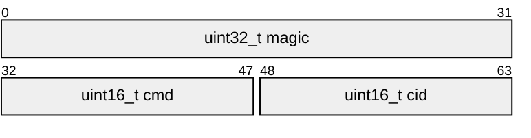

## Commands

One command space for every role, grouped into ranges: `0x00` session (every
role), `0x01..0x1f` data (OST), `0x20..0x3f` metadata shared by OST and MDS,
`0x40..0x5f` object (MDS). `SET_SYNC_STATE` and `META` predate the grouping and
keep `0x0b`/`0x0c`.

| cmd | name | role | request payload | response payload |
|---|---|---|---|---|
| `0x00` | `SET_OBJECT` | all | Basic (`val` = open flags, e.g. `RAWSTOR_READONLY`) | — |
| `0x01` | `READ` | OST | IO | data (`res` bytes) |
| `0x02` | `WRITE` | OST | IO, then `len` bytes of data | — |
| `0x03` | `DISCARD` | OST | IO | — |
| `0x04` | `ALLOCATE` | OST | Allocate | — |
| `0x05` | `RELEASE` | OST | Basic (non-nil `snapshot_id`: that version only) | — |
| `0x06` | `LIST` | OST | List | List rows |
| `0x08` | `LOCATION_INFO` | OST | Basic (unused) | `RawstorLocationInfo` |
| `0x09` | `FLUSH` | OST | Basic (unused) | — |
| `0x0a` | `WRITE_ZEROES` | OST | IO (`flags`: `SYNC`, `UNMAP`) | — |
| `0x0b` | `SET_SYNC_STATE` | OST | SyncState | — |
| `0x0c` | `META` | OST | Basic (`offset` = chunk offset) | Meta |
| `0x0d` | `SNAPSHOT` | OST | Basic (`snapshot_id` = new version) | — |
| `0x40` | `OBJ_CREATE` | MDS | ObjCreate | ObjCreated |
| `0x41` | `OBJ_OPEN` | MDS | Basic (`snapshot_id`, nil = live) | ObjDescriptor + chunks |
| `0x42` | `OBJ_RESIZE` | MDS | Basic (`val` = new size) | ObjResized |
| `0x43` | `OBJ_REMOVE` | MDS | Basic | — |
| `0x45` | `OBJ_SNAP_COMMIT` | MDS | ObjSnapCommit + members | ObjSnapCommitted |
| `0x46` | `OBJ_SNAP_REMOVE` | MDS | Basic (`snapshot_id`) | ObjSnapMember records |

Ids (`object_id`, `snapshot_id`, `ost_id`, ...) are 16-byte UUIDs; a nil
`snapshot_id` means the live version. Object and snapshot ids are generated by
the client.

## Responses

Every response is the head followed by a 12-byte body; a payload, if any,
follows right after.

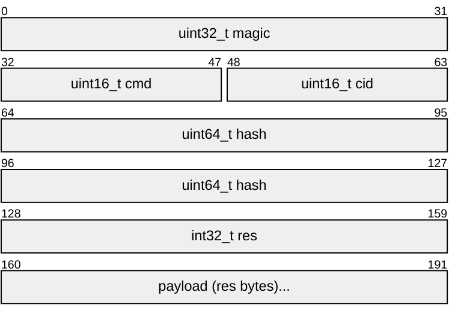

- `res < 0` is `-errno`; no payload follows.
- `res >= 0` is the payload size in bytes (for `READ`/`WRITE`/`DISCARD`/
  `WRITE_ZEROES`, the number of bytes handled); `0` means no payload.
- `hash` covers the payload (the data, for `READ`) and is checked by the
  receiver: xxh3 when built with libxxhash, 0 otherwise and whenever the
  sender doesn't compute one (the MDS never does).

## Request payloads

### Basic — 48 bytes

Shared by every command that only names an object: `SET_OBJECT`, `RELEASE`,
`SNAPSHOT`, `META`, `LOCATION_INFO`, `FLUSH` and the MDS's `OBJ_OPEN`,
`OBJ_RESIZE`, `OBJ_REMOVE`, `OBJ_SNAP_REMOVE`. `offset` is the chunk offset of
the object `object_id` names (0 for a plain object); `val` is
command-specific.

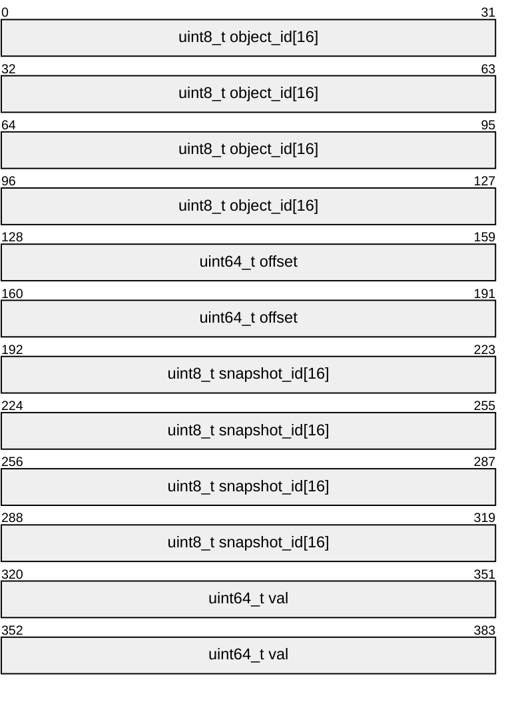

### IO — 21 bytes

`READ`, `WRITE`, `DISCARD`, `WRITE_ZEROES` on the bound object. `hash`
covers the data that follows a `WRITE` (same hash as a response's), 0
otherwise. `flags`:
`RAWSTOR_FLAG_SYNC` (durable before the response; `WRITE`, `WRITE_ZEROES`),
`RAWSTOR_FLAG_UNMAP` (may deallocate; `WRITE_ZEROES`).

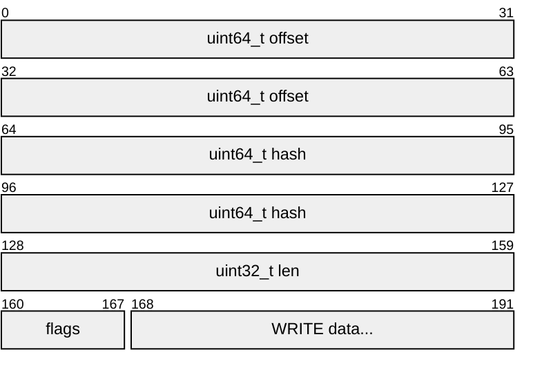

### List — 20 bytes

`limit` ids per page, starting after `token_id` (nil = from the start).

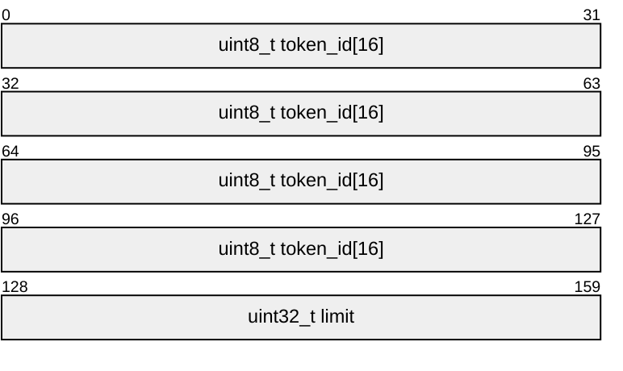

### SyncState — 73 bytes

Sets one copy's mirror consistency state (see [mirroring](mirroring.md)).

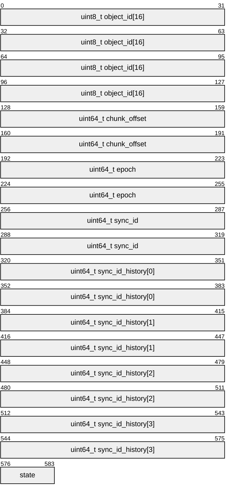

### Allocate — 48 bytes

Creates one copy of one chunk. `chunk_shift` is `log2(chunk_size)`, 0 for an
unchunked object; `stripe_width`/`failure_domain`/`width`/`member_role` are the
chunk's placement identity, stored with it.

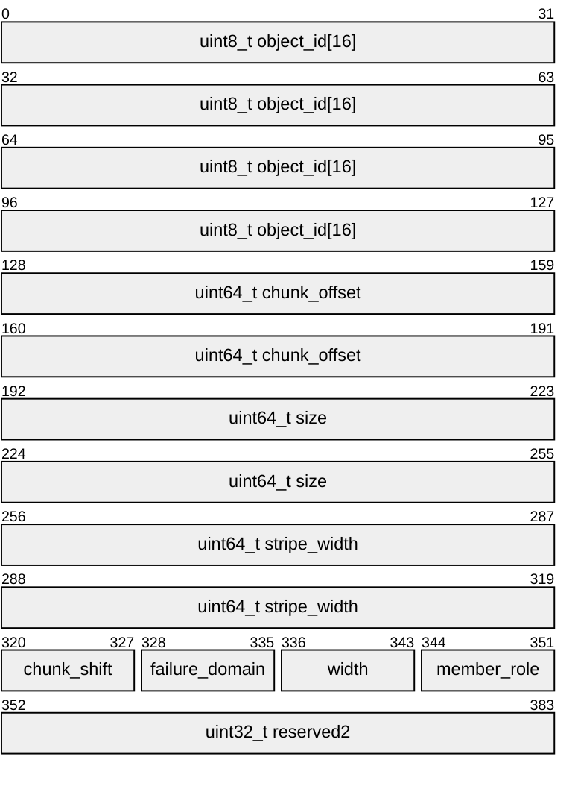

## Response payloads

### List rows — 24 bytes each

One row per (id, chunk offset); an id with several chunks spans consecutive
rows. The **last** row is always the resume cursor for the next page (a nil id
once nothing is left), never a result. An empty payload means the far end is
already exhausted.

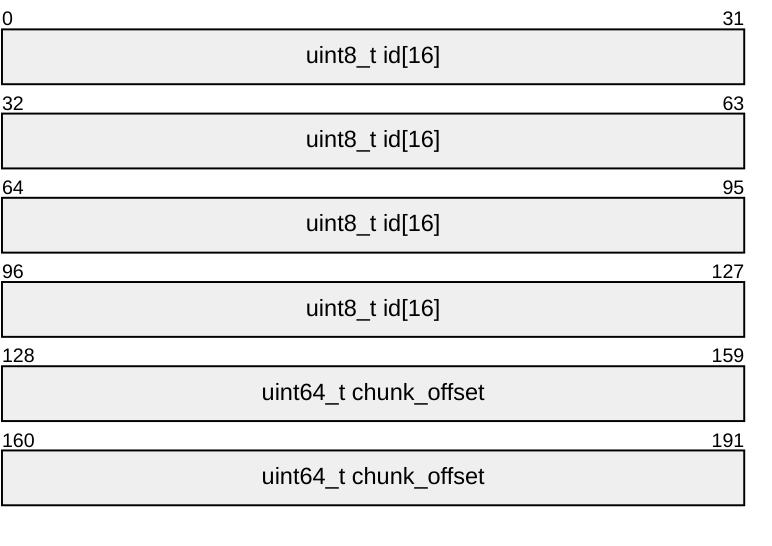

### Meta — 64 bytes

Everything about one stored copy: its size, its placement identity and its
mirror consistency state.

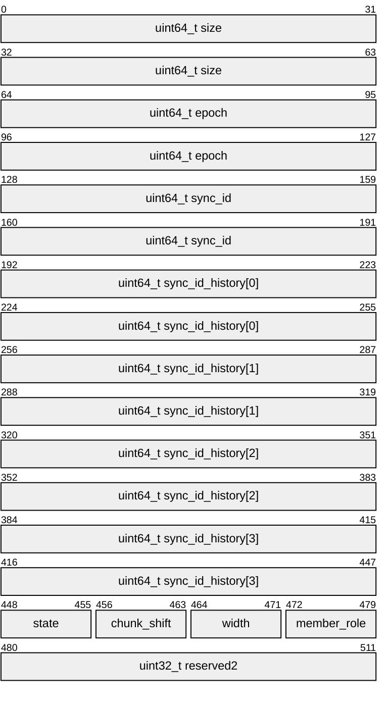

### RawstorLocationInfo — 16 bytes

`uint64_t used`, `uint64_t total` (see `<rawstor/location.h>`).

## Object (MDS) payloads

### ObjPolicy — 20 bytes

Embedded in ObjCreate and ObjDescriptor. `reserved` rounds it to a 4-byte
boundary so a 32-bit field right after it stays aligned.

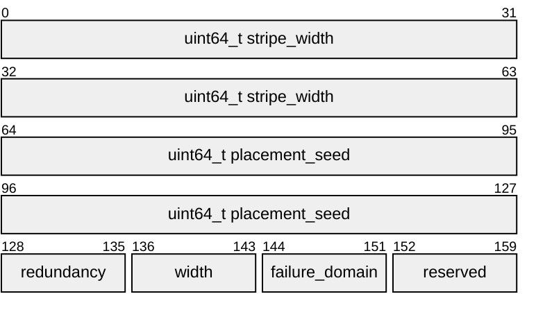

### ObjCreate — 45 bytes

`chunk_shift` is `log2(chunk_size)`; an mds:// object's `chunk_size` is always
a nonzero power of two, so 0 (and anything from 64 on) is rejected.

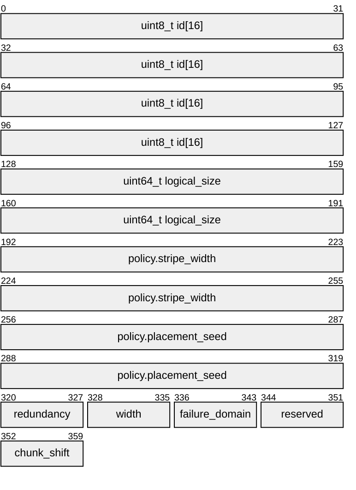

ObjCreated, ObjResized and ObjSnapCommitted are a single `uint64_t map_epoch`.

### ObjDescriptor — 57 bytes, then the chunk map

`OBJ_OPEN`'s reply: the descriptor, then `nchunks` chunk entries, each a
`uint8_t width` followed by `width` slots. A slot is 19 bytes followed by
`location_len` bytes of its OST's location URI (e.g. `ost://host:7777`, not
null-terminated); `location_len` is 0 when the topology no longer lists that
OST.

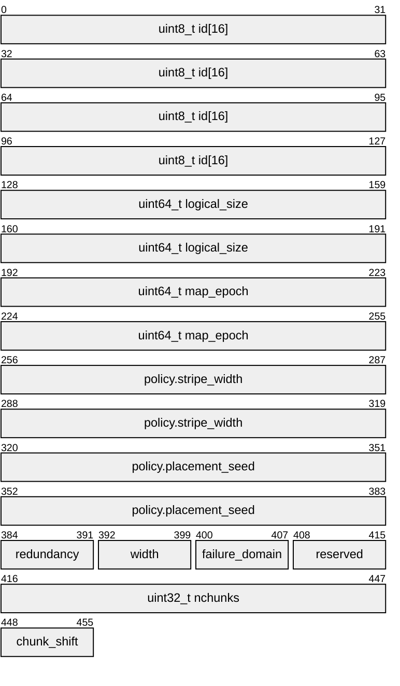

Each chunk entry:

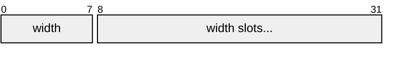

Each slot:

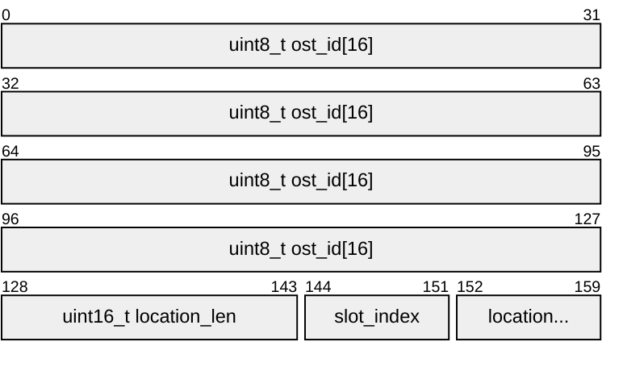

### ObjSnapCommit — 36 bytes, then members

Registers a snapshot version: `nmembers` ObjSnapMember records follow, one per
chunk copy that holds it. `OBJ_SNAP_REMOVE` replies with the same records (the
copies to destroy).

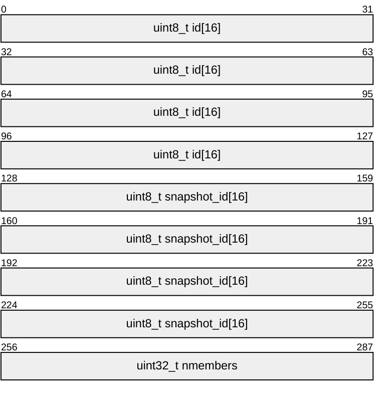

ObjSnapMember — 24 bytes:

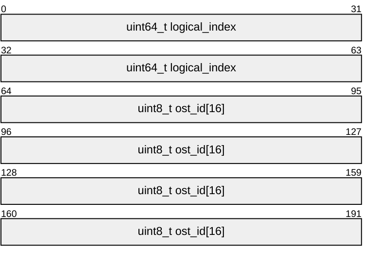
